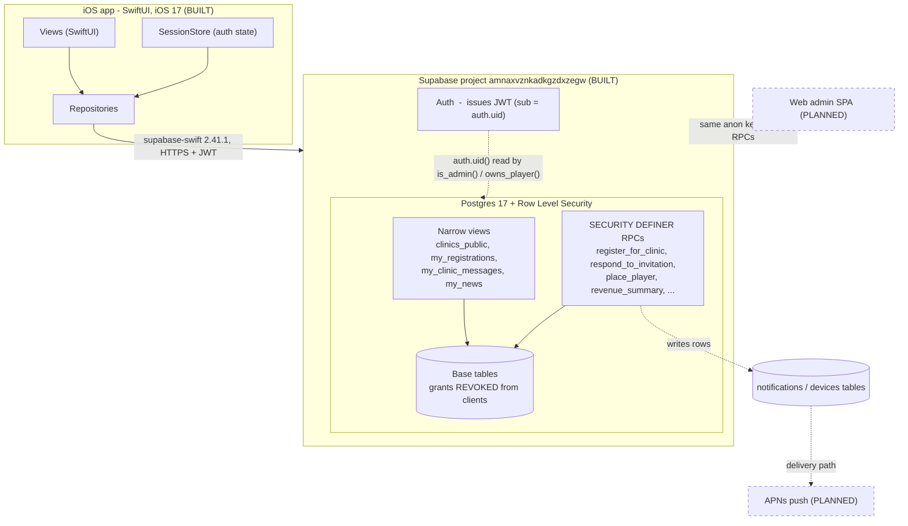

> **PARTIALLY STALE (banner added 2026-09-01).** Written 2026-08; predates
> sign-up, the admin tab, the live web admin, late requests, templates and the
> explicit-grants migration. For current state trust `CLAUDE.md`,
> `docs/roadmap.md` and `docs/whats-next.md`. Rewrite tracked in the backlog.

# FXE Tennis: Architecture

The one document to read before touching this system. Written for a product
manager or a new engineer who needs to understand what FXE Tennis is, how it is
built, and, just as important, what is deliberately not built yet.

> This is **FXE Tennis**, a clinic-registration app for a single tennis pro
> (Tara) and her members. It is a separate product from Volee. Where a design
> choice was learned from Volee it is noted, but the two share no code and no
> database.

---

## 1. What FXE Tennis is

Tara runs weekly tennis clinics at a member club. Today she runs them from text
messages, a spreadsheet, and a handwritten court sheet. FXE Tennis replaces that
notebook.

A **player** browses the clinics coming up, registers, and either lands a spot
(`You're In!`) or joins the **Player Pool**. Tara, the single **admin**, builds
the weekly schedule, decides who comes off the Pool, assigns courts, sends
clinic messages, and reconciles who has paid. The app manages information; Tara
manages tennis. Nothing is ever auto-promoted off the Pool: she picks every
player by hand, on purpose.

The product has two halves:

- **A player iOS app** (SwiftUI). Built, described in section 4.
- **An admin surface.** For v1 the phone app carries a small amount of
  courtside admin; the fuller admin is a laptop web app that is **designed and
  approved but not yet built** (section 8).

Everything of consequence, every rule about who can see what and who can do
what, lives in the Postgres database, not in the app. That is the single most
important thing to understand here, and it is section 5.

---

## 2. Status at a glance

| Area | State |
|---|---|
| Postgres schema, RLS, views, RPCs | **Built**, applied to the hosted project |
| Security model (revoked grants + narrow views + admin gate) | **Built**, pinned by probes |
| Pricing (member/non-member x 60/90 min) and revenue report | **Built** |
| SQL probe suite + GitHub Actions CI | **Built** |
| iOS auth, session, three-tab shell | **Built** |
| iOS clinic browse, per-viewer pricing, "registration opens" labels | **Built** |
| iOS profile + NTRP rating explainer | **Built** |
| iOS clinic detail, register/cancel buttons, invitation accept/decline, news feed, in-app action center | **Partial / planned** (repositories exist, screens not yet wired) |
| APNs push delivery | **Planned** (DB groundwork exists, no delivery path) |
| Web admin SPA | **Planned** (decision recorded, some admin RPCs still to write) |
| Stripe card payments | **Planned** for v1.1 (v1 uses Zelle + a report) |
| Juniors / parent accounts | **Planned** (enum values kept in schema; UI deferred) |

---

## 3. System diagram



Solid = built and in use. Dashed = planned. The player app and the future web
admin are just two clients of the same API: Postgres cannot tell them apart and
does not need to, because it never trusts the caller in the first place.

---

## 4. The client (iOS app)

SwiftUI, deployment target **iOS 17.0** (so `@Observable`, `NavigationStack`,
`.refreshable` are used freely). iPhone only for v1. The single dependency is
**supabase-swift 2.41.1**, pinned to match a known-good version on this backend
stack.

### Project generation: XcodeGen

The `.xcodeproj` is **generated** from `project.yml`, never hand-edited and never
committed. Regenerate with `xcodegen generate`. Sources are globbed from the
`FXETennis/` folder at generation time, so a new `.swift` file is picked up
automatically with no "add to target" step. This is what lets multiple people
(or agents) add files in parallel without ever merge-conflicting a `pbxproj`.

The bundle id `com.fxetennis.app` and the `com.fxetennis` prefix are
**placeholders** pending the FXE Tennis, LLC entity (see the roadmap "Ship"
section).

### Layering

```
FXETennis/
├── App/
│   ├── FXETennisApp.swift     @main; RootView auth gate; LaunchView
│   └── Session.swift          SessionStore: @Observable auth + identity store
├── Data/
│   ├── SupabaseClient.swift   the one `supabase` client (URL + publishable key)
│   └── Repositories.swift     every read/write; views never call the client directly
├── Models/
│   ├── CoreModels.swift       Codable structs mapped 1:1 to the DB views/tables
│   ├── NTRPRating.swift       the USTA rating scale for the "?" explainer
│   └── NotificationCopy.swift the full notification catalogue (copy + triggers)
├── Resources/
│   └── Brand.swift            design tokens (navy/cream palette), the gator mark
└── Views/
    ├── AuthView.swift         sign in / sign up
    ├── MainTabView.swift      three tabs: Home, Clinics, Profile
    ├── HomeView.swift         "My Clinics" + "Available This Week" glance
    ├── ClinicsView.swift      month-ahead browse + ClinicsViewModel + ClinicCard
    └── ProfileView.swift      player details + NTRPExplainerSheet
```

Four ideas run through the client code:

1. **One Supabase client.** `Data/SupabaseClient.swift` holds a single global
   `supabase` instance. The publishable key ships in the binary on purpose: it
   grants only what RLS allows, which for a player is their own rows plus the
   public views. Every real permission lives in Postgres.

2. **Repositories are the only door to the network.** `Data/Repositories.swift`
   is stateless enums of `static async` funcs (`ClinicRepository`,
   `RegistrationRepository`, `NewsRepository`, `ProfileRepository`). Views never
   touch `supabase` directly. One place to change when an RPC changes, and one
   place a reviewer can confirm the client never reads a hidden table. The client
   reads the narrow views (`clinics_public`, `my_registrations`, …) plus two base
   tables it is deliberately allowed — `accounts` and `players`, whose grants are
   NOT revoked because RLS scopes them to the caller's own rows — and calls only
   the player-facing RPCs. The seven hidden tables have their grants revoked; the
   client cannot read them at all.

3. **Models mirror the views, and absence is a feature.** `CoreModels.swift` is
   mapped to the DB with explicit `CodingKeys`. It has no field for capacity, no
   counts, no other players, because those columns are not in the views the
   client reads. The app *cannot* display a hidden fact even by accident.

4. **`SessionStore` is the injected identity.** Created once in `FXETennisApp`,
   put in the environment, and read by every screen as
   `session.account` / `session.activePlayer`. `RootView` switches on
   `session.phase` (`loading` / `signedOut` / `signedIn`) to pick LaunchView,
   AuthView, or MainTabView. v1 is adults-only, so `activePlayer` is simply the
   account's single player.

### What the app does today, honestly

- **Auth:** sign in and sign up via Supabase Auth (email + password). Everyone
  makes an account.
- **Home:** a glance of "My Clinics" and "Available This Week" (max 3 each).
- **Clinics:** browses every published clinic a month ahead. A clinic not yet
  open shows "Registration opens Aug 8" instead of a register affordance. Each
  card shows the price **for this viewer** (`priceCents(forMember:)`), because
  members and non-members pay different rates.
- **Profile:** the player's name, contact, member status, and NTRP rating, plus
  the rating-guide sheet behind a "?" button, and sign out.

`RegistrationRepository` already exposes `register` / `cancelRegistration` /
`leavePool` / `respondToInvitation`, and `ClinicRepository.messages` and
`NewsRepository` exist, but the screens that drive them (a clinic-detail page,
the register/cancel buttons, invitation accept/decline, a News feed, an in-app
action center) are **not yet wired**. The view files that exist call themselves
"shells" in their headers for this reason. This is the main gap between the
built backend and the built UI.

---

## 5. The backend (Supabase / Postgres) and its security model

### Hosted project

- **Project ref:** `amnaxvznkadkgzdxzegw` (name `fxe-tennis`, region
  `us-east-1`).
- **URL:** `https://amnaxvznkadkgzdxzegw.supabase.co` (in
  `SupabaseClient.swift`).
- **Postgres 17.** Local development uses the Supabase CLI; `config.toml` names
  the local project `FXE-Tennis` and loads `supabase/seed.sql` on `db reset`.
- **Migrations** live in `supabase/migrations/` and are applied in filename
  order. A migration that has been applied to the hosted database is **never
  edited in place**, only superseded by a new one (CI enforces this, section 7).

### The central security rule, in plain terms

Nine things are hidden from players:

> clinic capacity, number registered, spots remaining, Player Pool size, other
> players' names, court assignments, other players' payment status, private
> coaching notes, and clinic location.

None of that can be enforced in SwiftUI: anyone with a network proxy reads the
raw JSON. So the hiding is done in the database, by two mechanisms working
together:

1. **Revoked table grants (the primary control).** The sensitive base tables
   (`clinics`, `registrations`, `player_notes`, `clinic_templates`,
   `clinic_messages`, `clinic_message_recipients`, `news_posts`) have **all
   grants revoked** from the `anon` and `authenticated` roles. A client literally
   cannot `select` them. A policy bug therefore cannot leak a column the client
   was never granted.

2. **Narrow views (what the client reads instead).** Purpose-built views expose
   exactly the safe columns:

   | View | What it is | Who sees what |
   |---|---|---|
   | `clinics_public` | Published/canceled clinics, both price rates, no capacity or counts | any authenticated user |
   | `my_registrations` | The caller's own registrations only (no court, no `canceled_by`) | scoped by `owns_player()` |
   | `my_clinic_messages` | `everyone` messages for clinics you are on, plus targeted messages sent to you | scoped to the caller |
   | `my_news` | Published news matching your audience, with a per-account `is_read` flag | scoped to the caller |
   | `clinics_admin` | `select * from clinics where is_admin()` | admin only, else zero rows |
   | `registrations_admin` | `select * from registrations where is_admin()` | admin only, else zero rows |
   | `revenue_by_clinic` / `revenue_by_segment` | Reconciliation aggregates | admin only, gated inside the view |

   RLS is also enabled on the base tables as **defense in depth**, but the
   grants are the load-bearing control.

### Who is an admin, who owns a player

Two `SECURITY DEFINER` helper functions, both with a pinned `search_path` (so
they cannot be hijacked):

- **`is_admin()`** returns true when the caller's `auth.uid()` maps to an
  `accounts` row with `role = 'admin'`. The admin views are literally
  `select * from <table> where public.is_admin()`, so **that predicate is the
  entire access control** on them. They are not `security_invoker`, so they run
  with owner rights and can read the base tables the client cannot; the
  `where is_admin()` is what keeps a player from seeing the full roster.
- **`owns_player(player)`** returns true when the player belongs to the caller's
  account. This is how `my_registrations` and every player-facing RPC scope to
  "your own".

Every write goes through a `SECURITY DEFINER` RPC (below). Admin RPCs open with
`perform public.require_admin()`, which raises `not_authorized` (SQLSTATE
`42501`) unless `is_admin()` is true.

### The privilege-column protection (a fixed real hole)

A player could once run `update accounts set role = 'admin' where id = <self>`
and defeat the entire model in one statement. Migration
`20260802000003_fix_privilege_escalation.sql` closed it with **three
independent layers**, any one of which suffices:

1. **Column-level grants.** `authenticated` may update only
   `first_name, last_name, phone` on `accounts` (and only name/DOB/rating/member
   flag on `players`). `role`, `id`, `account_id` are not grantable to clients.
2. **`WITH CHECK` on the RLS policies**, pinning the identity columns so the new
   row cannot differ from the old.
3. **Triggers** (`guard_account_privilege_columns`, `guard_player_owner_column`)
   so the invariant holds even for a future path with different grants: only an
   admin may change a role, and nobody may move an account id or a player's
   owner.

This attack is now reproduced and asserted-to-fail by
`tests/sql/privilege_escalation.sql`.

### The real tables

All in schema `public`. (`accounts.push_enabled` was dropped by a later
decision; noted so nobody re-adds it.)

| Table | What it holds |
|---|---|
| `accounts` | The login/identity. `role` is `member` or `admin`. One row per `auth.users` row. |
| `players` | One row per person who can be registered. An adult has one (themselves); a parent has one per child. Stores `date_of_birth` (age is derived, never stored), `adult_rating` (NTRP `numeric(2,1)`), `is_member`, `is_active`. |
| `player_notes` | Private coaching notes, in their own table so a careless `select *` on players cannot leak them. Admin only. |
| `clinic_templates` | Reusable clinic definitions (name, audience, prices, duration, capacity). |
| `clinics` | A scheduled clinic. Carries `internal_capacity`, the two prices, `member_opens_at` / `public_opens_at` windows, `status` (`draft`/`published`/`canceled`). |
| `registrations` | The heart of the domain. Joins clinic + player, with `status`, `paid`, `court_number` (admin only, 1-5), and the **price snapshot** (`price_cents_charged`, `was_member`, `duration_minutes`). |
| `clinic_messages` + `clinic_message_recipients` | Clinic broadcasts; targeted messages snapshot their recipients at send time. |
| `news_posts` + `news_reads` | Club announcements; unread state is per **account** (a parent reads once). |
| `notifications` | In-app notification rows written by the RPCs. |
| `devices` | APNs tokens per account (groundwork for push; no delivery yet). |
| `app_settings` | Small, player-safe, admin-editable strings. Holds Tara's exact payment line. Never stores anything hidden. |

Enums: `account_type`, `account_role`, `player_kind`, `clinic_audience`
(`ladies`/`men`/`coed`/`juniors`; juniors kept but not offered in v1),
`clinic_status`, `registration_status` (`in`/`pool`/`response_needed`/
`canceled`), `message_audience`, `news_audience`, `registration_source`
(`self`/`admin`).

### The key RPCs

**Player-facing** (granted to `authenticated`, each self-gated by
`owns_player()`):

| RPC | What it does |
|---|---|
| `register_for_clinic(clinic, player)` | The one capacity decision in the app (see section 6). Returns `You're In!`, Player Pool, or a friendly rejection. |
| `respond_to_invitation(registration, accept)` | Accept or decline a spot Tara offered. Conditional update, so a race with her canceling is handled cleanly. |
| `cancel_registration(registration)` | Cancel a live registration (player or admin). Preserves the row. |
| `leave_pool(registration)` | Withdraw from the Player Pool (deletes the pool row). |
| `mark_news_read(news)` | Marks a post read for this account. |
| `payment_instructions()` | Returns Tara's exact Zelle/Venmo string from `app_settings`. |

Helpers also exposed to clients: `player_age`, `member_opens_at`,
`public_opens_at`, `service_week_start`, `is_admin`, `owns_player`.

**Admin** (each opens with `require_admin()`):

| RPC | What it does |
|---|---|
| `create_clinic_from_template(template, starts_at, ends_at?)` | Copy-on-create: editing a template later never rewrites past clinics. |
| `publish_clinic` / `cancel_clinic` | Draft to published; cancel and notify everyone in a live status. |
| `invite_from_pool(registration)` | Move a pooled player to `response_needed` and notify them. Tara's hand-pick. |
| `cancel_invitation(registration)` | Take an outstanding invitation back. |
| `place_player(clinic, player, status)` | Walk-up placement. Ignores window and capacity by design (Tara's judgment overrides). Still snapshots the price. |
| `set_paid(registration, paid)` | Tick a registration paid/unpaid. |
| `assign_court(registration, court)` | Set court 1-5 (or null). |
| `send_clinic_message(clinic, audience, body)` | Broadcast to `everyone` / `in` / `pool` / `response_needed` / `unpaid`; targeted recipients are snapshotted. |
| `publish_news(news)` | Publish a draft post. |
| `set_player_active(player, active)` | Deactivate/reactivate a player (archive, never delete). |
| `search_players(query, include_inactive?)` | Forgiving name search; returns `has_notes` as a boolean, never the note body. |
| `revenue_summary(from?, to?)` | The reconciliation report (section 7 of pricing; see below). |

**Internal plumbing** (`notify_account`, `admin_account_ids`) is revoked from
every client role. A client can never fabricate a notification.

---

## 6. The registration model (the one place software decides capacity)

This is the domain rule most worth understanding.

**Service-week windows.** Registration opens per **service week**
(Sunday-Saturday, `America/New_York`), not per clinic. Every clinic in a week
shares one pair of open times, derived only from the week's anchor Sunday:

- **Members:** 8:00 AM on the Thursday before (anchor Sunday minus 3 days).
- **Non-members:** 8:00 AM the following Friday (anchor Sunday minus 2 days),
  24 hours later. Members keep access after Friday; Friday widens the audience.

The zone is named, not a fixed offset, so 8:00 AM stays 8:00 AM across daylight
saving. These are stored as columns on each clinic (so Tara can override one)
but defaulted from `member_opens_at()` / `public_opens_at()`. The rule and its
DST/timezone traps are pinned by `tests/sql/registration_window_rule.sql`. See
decision 0001.

**The capacity decision.** `register_for_clinic` is the only place capacity is
decided, and it does so inside one transaction with the clinic row locked
(`FOR UPDATE`), because two members tapping Register in the same second must not
both land a spot. The branches:

- member, inside the priority window, room left, to `You're In!`
- member, inside the window, full, to Player Pool
- member or non-member, after public opening, to Player Pool
- anyone, before their window, rejected

A partial unique index (`registrations_one_live`) allows at most one live
registration per player per clinic, which also makes a retried request
idempotent rather than a double-booking.

**Nothing auto-promotes.** A spot opening does not pull the next person in. Tara
calls `invite_from_pool`, the player gets a `response_needed` invitation, and
`respond_to_invitation` resolves it. This is the product, not a limitation. The
concurrency (two members racing, or Tara canceling an invitation as the player
accepts) is exercised by `tests/sql/capacity_race.sh`.

---

## 7. Payments, pricing, and the revenue report

**v1 moves no money in the app.** Tara keeps taking **Zelle (preferred) and
Venmo**, and the app gives her a report to reconcile against. Stripe (card on
file, charged later) is deferred to v1.1. Apple does not require in-app purchase
for a real-world service like tennis clinics, so Stripe-direct is allowed later.
This is decision **`docs/decisions/0003-payments.md`**.

**Pricing** is member-vs-non-member by clinic length (Tara's locked table):

| | 60 min | 90 min |
|---|---|---|
| Member | $18 | $22 |
| Non-member | $23 | $28 |

`default_price_cents()` supplies these as defaults when a clinic is created (via
a trigger), but Tara can override either price on any clinic.

**The snapshot (decision 0002).** At registration time,
`register_for_clinic` and `place_player` copy three **historical facts** onto the
registration row: `price_cents_charged`, `was_member`, and `duration_minutes`.
These never change afterward. The reason is reconciliation: editing a clinic's
price in September must not silently rewrite what August earned, and correcting a
self-reported membership flag must not change what someone already owed.

**The report.** `revenue_summary(from, to)` returns exactly what Tara reads off
her notebook today: how many member and non-member players did 60- and 90-minute
clinics (four numbers), plus totals for players, expected, collected, and
outstanding cents. Anything not 60/90 min lands in `other_players` so the buckets
always reconcile to the total. The `revenue_by_clinic` and `revenue_by_segment`
views give the per-clinic and month-by-segment breakdowns. All admin-gated. Only
`status = 'in'` counts, because a Player Pool entry owes nothing.

---

## 8. Notifications and the web admin (both partly planned)

### Notifications

The **catalogue is fully specified** in `Models/NotificationCopy.swift` (the
copy is Tara's, verbatim; contradictions and open questions are tracked in
`docs/notifications.md`). The RPCs already **write `notifications` rows** via the
internal `notify_account` helper, and the `devices` table exists to hold APNs
tokens.

What is **planned, not built:** actual **APNs push delivery**. There is no edge
function that sends a push, and the iOS client does not register for remote
notifications or upload a device token yet. So notifications are recorded
server-side today; delivering them to a lock screen is future work. A few
catalogue entries (invitation expiry, the "registration is open" broadcast) are
also explicitly not wired pending Tara's decisions.

### Web admin

The heavier admin (build a week of clinics, edit templates, drag players across
courts, player directory with private notes, the revenue screen) is designed to
be a **separate static single-page app** (Vite + React), hosted on a CDN, talking
directly to the same Supabase project with the same anon key. It holds **no key
more powerful than the phone does**: `is_admin()` in Postgres is the whole gate,
so the web app is just another client. The full decision, including why there is
no application server, is in `docs/web-admin.md`.

It is **accepted but not built.** That document also lists the admin RPCs still
to write (`admin_upsert_template`, `admin_upsert_clinic`, `admin_upsert_news`,
`admin_get_player_note` / `admin_set_player_note`, `admin_clinic_roster`) before
the corresponding screens can exist.

---

## 9. Testing and CI

The invariants that matter are in Postgres, so the test suite is too. (The
the `FXETennisTests` unit-test target exists but is **empty**: there are no
Swift unit tests yet. There is no UI-test target in `project.yml`.)

**SQL probes** in `tests/sql/`, each a `.sql` file that prints `PASS`/`FAIL`
lines:

| Probe | Asserts |
|---|---|
| `information_hiding.sql` | A non-admin cannot read any of the nine hidden facts through any surface. |
| `privilege_escalation.sql` | Performs the self-promote-to-admin attack and asserts it fails. |
| `registration_window_rule.sql` | The service-week window math, including the timezone/DST traps, for all seven weekdays. |
| `registration_windows.sql` | Member/non-member/rejected branches of `register_for_clinic`. |
| `pricing_and_revenue.sql` | Price snapshot correctness and `revenue_summary` totals. |
| `schema_decisions.sql` | Tara's decisions that have a DB consequence stay true. |
| `capacity_race.sh` | Concurrency: two racing registrations, invite-vs-accept race. |

`tests/run-probes.sh` runs them all against a local Postgres and prints one
red/green table. It has been hardened to fail on silent SQL errors and on a
probe that ran zero assertions (both had let failures through before). The
roadmap counts ~142 automated checks across these.

**GitHub Actions** (`.github/workflows/probes.yml`), on every push to `main`
and every pull request, hosted at `github.com/Volee-Team/FXE`:

1. **`sql-probes`:** spin up a local Supabase stack, `supabase db reset` (which
   applies every migration in order, then the seed, so a broken migration or a
   seed that violates a new constraint fails here), then run the probe suite.
2. **`migration-immutability`:** fail the PR if any already-committed migration
   file was modified rather than superseded. This protects the "never edit an
   applied migration" rule.

---

## 10. Where decisions live

Design decisions are recorded as short ADRs in `docs/decisions/`, and the plan
of record is `docs/roadmap.md`. Start there before proposing a change:

- **0001** Registration opens per service week, not per clinic.
- **0002** Copy the price onto the registration (the snapshot).
- **0003** Zelle + a report for v1, Stripe in v1.1.
- **0004** Adults only in v1; juniors stay in the schema.
- **0005** Clinic messaging is a broadcast with three audiences.

Other living docs: `docs/notifications.md` (catalogue + open questions),
`docs/web-admin.md` (the SPA design), `docs/ntrp-chart.md` (the rating scale),
`docs/backlog.md`, and the repo's `CLAUDE.md` (working rules and the changelog).

---

## 11. Deliberately not in v1

Saying no is a decision too, and these keep coming back if unwritten:

- **In-app purchase / Apple Pay for clinic fees.** Not required for a real-world
  service; Zelle keeps Apple's cut off a $23 fee.
- **Auto-promoting from the Player Pool, and auto-expiring invitations.** Tara
  picks every player and takes a spot back by hand. This is the product.
- **Showing players any capacity, count, or other player.** The hard rule the
  whole schema is built around.
- **Juniors and parent-managed child accounts.** Enum values are already in the
  schema, so this is UI work later, not a migration.
- **A category filter on clinics.** The column exists (free text, display only)
  but is deliberately unindexed; there is no filter.

Open questions still on the board include whether FXE runs Saturday clinics and
how short holiday weeks anchor (both affect the window math), tracked in the
roadmap's "Parked" section.
