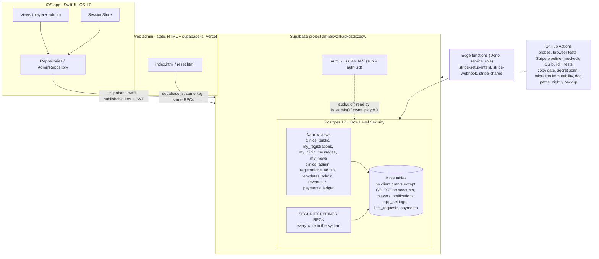

# FXE Tennis: Architecture

The one document to read before touching this system. Written for a product
manager or a new engineer who needs to understand what FXE Tennis is, how it is
built, and, just as important, what is deliberately not built yet.

Regenerated 2026-09-01 from the live schema, the file tree, and the probe
suite; refreshed by hand 2026-09-12 after the docs audit (payments, the
ledger, the 4-hour cancel, push groundwork, and every count). The previous
version (2026-08) predated sign-up, the admin tab, the live web admin, late
requests, templates and the explicit-grants work. Where this
document and the code disagree, the code wins and this file gets fixed; the
changelog in `CLAUDE.md` is the day-by-day record.

> This is **FXE Tennis**, a clinic-registration app for a single tennis pro
> (Tara) and her members. It is a separate product from Volee. Where a design
> choice was learned from Volee it is noted, but the two share no code and no
> database.

---

## 1. What FXE Tennis is

Tara runs weekly tennis clinics at a member club. Until now she ran them from
text messages, a spreadsheet, and a handwritten court sheet. FXE Tennis replaces
that notebook.

A **player** browses the clinics coming up, registers, and either lands a spot
(`You're In!`) or joins the **Player Pool**. Tara, the single **admin**, builds
the weekly schedule, decides who comes off the Pool, assigns courts, sends
clinic messages, and reconciles who has paid. The app manages information; Tara
manages tennis. Nothing is ever auto-promoted off the Pool: she picks every
player by hand, on purpose.

The product has three surfaces on one backend:

- **The player iOS app** (SwiftUI). Section 4.
- **The admin tab inside that same app**, for what Tara does standing on a
  court: rosters, invitations, courts, paid, reminders, late requests, the
  player directory. Section 4.
- **The web admin**, a static page for the laptop half of her week: building
  clinics from templates, Action Needed, Money, and the same directory. Live
  at `fxe-tennis-admin.vercel.app`. Section 8.

Everything of consequence, every rule about who can see what and who can do
what, lives in the Postgres database, not in any client. That is the single
most important thing to understand here, and it is section 5.

---

## 2. Status at a glance

| Area | State |
|---|---|
| Postgres schema, RLS, narrow views, RPCs | **Built**, 27 migrations, all applied to hosted (verified 2026-09-12, `supabase migration list --linked`) |
| Security model (explicit grants, revoked base tables, admin gate, anon executes nothing) | **Built**, enumerated by probes |
| Pricing (member/non-member x 60/90 min), snapshot, revenue report | **Built** |
| SQL probe suite (18 probes; the suite prints its own total) + concurrency probe, in CI | **Built** |
| iOS: sign-in, sign-up with profile, password reset, three tabs | **Built** |
| iOS: browse by week, per-viewer pricing, register / cancel (4-hour note inside the cutoff) / leave pool / respond, closed-clinic "Message Tara", the bell, My Clinics, profile edit, card on file | **Built** |
| iOS admin tab: rosters, invite, courts, paid, unpaid reminder, message audiences, late requests, Action Needed, player directory | **Built** |
| Web admin: clinic + template CRUD (archive, never delete), rosters, walk-up, courts, reminder, Action Needed, Money with the card ledger, directory, password reset | **Built**, live on Vercel |
| Nightly `pg_dump` backup + keep-warm | **Built**, first artifact 2026-09-01 |
| APNs push delivery | **Client half built** (permission sheet, registration, `register_device`; decision 0008). The sender waits on the APNs key, which only the Apple Developer account can issue. `notifications` rows are written; nothing delivers them |
| Stripe card payments | **Built, switched off** (decision 0009): ledger, RPCs, three edge functions ACTIVE on hosted, card screen, `payments_ledger`. `app_settings.payments_enabled` is `false`; nothing charges until Tara answers Q27–42 |
| Juniors / parent accounts | **Deferred** to November or the spring session (decision 0007) |
| App Store / TestFlight | **Blocked** on Apple Developer enrollment for FXE Tennis, LLC |

---

## 3. System diagram



The phone and the web page are two clients of one API. Postgres cannot tell
them apart and does not need to, because it never trusts the caller.

---

## 4. The client (iOS app)

SwiftUI, deployment target **iOS 17.0**. iPhone only for v1. Two dependencies
(`project.yml`): **supabase-swift** (2.41.1, pinned), configured for the
*implicit* auth flow because the password-reset email must be finishable in a
browser on another device (PKCE binds the one-time code to the device that
asked); and **stripe-ios**, PaymentSheet only, so a card number never touches
our code. Light appearance is forced at the root; the palette has no dark
variant.

### Project generation: XcodeGen

The `.xcodeproj` is **generated** from `project.yml`, never hand-edited and
never committed. `xcodegen generate` globs `FXETennis/`, so a new `.swift` file
is picked up with no "add to target" step. CI regenerates on a fresh clone, so
a broken `project.yml` fails there first.

### Layering

```
FXETennis/
├── App/
│   ├── FXETennisApp.swift       @main; RootView switches on session.phase; forces .light
│   ├── Session.swift            SessionStore: auth, account, activePlayer, isAdmin,
│   │                            signUp → create_my_account, password reset
│   ├── PushRegistrar.swift      client half of decision 0008: permission (once, Tara's line),
│   │                            APNs registration, token → register_device; sends nothing
│   └── AppEnv.swift             DEBUG vs release: local stack vs hosted, reset URL
├── Data/
│   ├── SupabaseClient.swift     the one client (URL + publishable key, implicit flow)
│   ├── Repositories.swift       player reads/writes: Clinic, Registration, News, Profile
│   ├── PaymentsRepository.swift asks stripe-setup-intent for what PaymentSheet needs; that is all
│   └── AdminRepository.swift    every admin RPC + the roster/late-request/notice models
├── Models/
│   ├── CoreModels.swift         Codable mirrors of the views (no hidden columns exist here)
│   ├── CancelPolicy.swift       decision 0010: is this cancel inside cancel_cutoff_hours? (pure, unit-tested)
│   ├── NTRPRating.swift         the USTA scale for the "?" explainer
│   ├── NotificationCopy.swift   Tara's notification catalogue, verbatim
│   └── ServiceWeek.swift        Sunday-in-New-York week math for grouping (pure, unit-tested)
├── Resources/
│   └── Brand.swift              tokens: navy / cream / court / brass, type, spacing, the gator mark
└── Views/
    ├── AuthView.swift           sign in, create account, forgot password
    ├── CompleteProfileView.swift name, phone, membership question, rating (after sign-up)
    ├── NotificationPermissionView.swift shown once after the profile exists, before iOS's own dialog;
    │                            Tara's Screen-3 sentence, two equal buttons
    ├── MainTabView.swift        Home, Clinics, Profile, plus Manage when isAdmin
    ├── HomeView.swift           My Clinics + Available Clinics glance, the bell with its badge
    ├── NotificationsView.swift  what the bell opens: rows the RPCs wrote, newest first, mark read
    ├── MyClinicsView.swift      the clinics I hold a live registration in, grouped by week, with chips
    ├── ClinicsView.swift        the list, grouped This week / Next week / Week of …
    ├── ClinicDetailView.swift   register / cancel / leave pool / respond, confirmations,
    │                            "Message Tara" once the clinic has closed
    ├── ClinicExplainerSheet.swift the "?" sheet (Tara's descriptions + the 105 definition)
    ├── ProfileView.swift        the player's own details, Payment method, version, sign out
    ├── EditProfileView.swift    name, phone, rating; membership shown as Tara's to correct
    ├── CardOnFileView.swift     the webhook's card summary, or Add a card → Stripe's PaymentSheet
    ├── AdminClinicsView.swift   Manage: Action Needed, Today, Upcoming, Past; toolbar → Players
    ├── AdminClinicDetailView.swift roster: courts, paid, invite, cancel invite, late requests,
    │                            Message Players, Remind unpaid
    └── PlayersDirectoryView.swift search, member / active switches, private note
```

Four ideas run through the client code:

1. **One Supabase client.** The publishable key ships in the binary on purpose:
   it grants only what the grants and RLS allow. Every real permission lives in
   Postgres.
2. **Repositories are the only door to the network.** Views never touch
   `supabase` directly. One place to change when an RPC changes, and one place
   a reviewer can confirm the client never reads a hidden table.
3. **Models mirror the views, and absence is a feature.** `CoreModels.swift`
   has no field for capacity, counts, or other players, because those columns
   are not in the views the client reads. The app cannot display a hidden fact
   even by accident. (`AdminRepository`'s models are the exception, and they
   are fed by admin-only views and RPCs that return zero rows to a player.)
4. **`SessionStore` is the injected identity.** `RootView` switches on
   `session.phase` (`loading` / `signedOut` / `needsProfile` / `signedIn`).
   `needsProfile` exists because Supabase sign-up creates only an auth user;
   `create_my_account` creates the `accounts` and `players` rows with the
   caller's `auth.uid()` as the id and `role` hard-coded to `member`.

Copy rule (hard rule 13): every user-visible string is either Tara's verbatim
or plain chrome checked by Alex. `scripts/extract-copy.py` snapshots every
string the extractor can see (direct `Text` / `Button` / `Label` literals and
HTML text nodes) into `docs/copy-approved.txt`; CI fails on one of those that
is not in the snapshot; `docs/copy-review.md` is where new ones wait. Strings
in ternaries, `return`s, assignments and JS template literals are invisible to
it, which is a known gap (`docs/backlog.md`, 2026-09-12), not a guarantee.

---

## 5. The backend (Supabase / Postgres) and its security model

### Hosted project

- **Project ref** `amnaxvznkadkgzdxzegw` (`fxe-tennis`, `us-east-1`),
  Postgres 17, free tier. Free-tier projects pause after a week idle; the
  nightly backup job doubles as the keep-warm.
- **Local development** uses the Supabase CLI pinned to **2.115.0** (also in
  CI; a version drift hid a broken grant surface for days). `supabase db reset`
  applies every migration then `supabase/seed.sql`.
- **Migrations** in `supabase/migrations/` apply in filename order and are
  pushed to hosted only with `supabase db push`. An applied migration is
  never edited, only superseded; CI enforces it.

### The central security rule, in plain terms

Nine things are hidden from players:

> clinic capacity, number registered, spots remaining, Player Pool size, other
> players' names, court assignments, other players' payment status, private
> coaching notes, and clinic location.

None of that can be enforced in a client: anyone with a proxy reads the raw
JSON. The hiding is done in the database by three mechanisms:

1. **Grants are explicit, in both directions.** Supabase's bootstrap gives new
   tables and views full privileges for `anon` and `authenticated`, and
   Postgres gives PUBLIC `EXECUTE` on every new function. Every migration
   therefore revokes before it grants (hard rule 11), and `authenticated` is
   granted exactly (`information_schema.table_privileges` and
   `column_privileges`, 2026-09-12): `SELECT` on `accounts`, `players`,
   `notifications`, `late_requests`, `payments` and `app_settings` (RLS scopes
   the first five to the caller; settings are player-safe by rule), column
   `UPDATE` on `accounts(first_name, last_name, phone)`,
   `players(first_name, last_name, adult_rating, date_of_birth, is_member)` and
   `notifications(read_at)`, `SELECT` on the narrow views, and `EXECUTE` on the
   client RPCs. `anon` holds nothing: no table, no view, no function. `tests/sql/grants_are_explicit.sql`
   enumerates `pg_class` and `pg_proc` rather than naming objects, so an
   object added next month is covered before anyone remembers to list it.
2. **Narrow views** expose exactly the safe columns:

   | View | What it is | Who sees what |
   |---|---|---|
   | `clinics_public` | Published/canceled clinics that have not ended, both price rates, no capacity or counts | any authenticated user |
   | `my_registrations` | The caller's own registrations (no court, no `canceled_by`) | scoped by `owns_player()` |
   | `my_clinic_messages` | `everyone` messages for your clinics plus targeted messages sent to you | scoped to the caller |
   | `my_news` | Published news for your audience with a per-account read flag | scoped to the caller |
   | `clinics_admin`, `registrations_admin`, `templates_admin` | Explicit column lists (never `select *`, which freezes at creation) `where is_admin()`. `registrations_admin` adds the computed `has_card` and `charge_status` so the roster can offer Charge | admin only, else zero rows |
   | `revenue_by_clinic`, `revenue_by_segment` | Reconciliation aggregates | admin only |
   | `payments_ledger` | Card payments with player and clinic named (2026-09-12): `id, kind, amount_cents, currency, status, failure_reason, created_at, updated_at, registration_id, refunds_payment_id, account_id, first_name, last_name, clinic_id, clinic_name, clinic_starts_at`. Exists because `registrations` is unreadable to clients on purpose, so PostgREST cannot embed through it | admin only |

   Views run with owner rights (not `security_invoker`), which is why writes
   through them are revoked outright: an auto-updatable view would bypass RLS.
3. **`service_role` is the one trusted writer.** Edge functions use it to write what no client may (ledger status, card summaries). It bypasses RLS by design and holds DML on every table by explicit grant (20260912000002) after the PUBLIC revokes had silently taken that away; the grants probe pins it.
4. **RLS on the base tables** as defense in depth. The grants are the
   load-bearing control; the policies catch what a grant mistake would miss.

### Who is an admin, who owns a player

- **`is_admin()`**: the caller's `auth.uid()` maps to an `accounts` row with
  `role = 'admin'`. The admin views are `… where is_admin()`, so that
  predicate is their entire access control.
- **`owns_player(player)`**: the player belongs to the caller's account. This
  scopes `my_registrations` and every player-facing RPC.
- **`require_admin()`** raises `42501` unless `is_admin()`; every admin RPC
  opens with it.
- **Becoming admin.** `role` is never a parameter anywhere. A BEFORE INSERT
  trigger (`bootstrap_first_admin`) promotes exactly one email, Tara's, at
  account creation, so she self-serves on the live site and nobody else can.

### The privilege-column protection

A player could once `update accounts set role = 'admin'`. Migration
`20260802000003` closed it three ways, any one sufficient: column-level
grants (`authenticated` may update `accounts`: name and phone; `players`: name,
rating, date of birth, membership; never `role` or `account_id`), `WITH CHECK` pinning
identity columns, and triggers (`guard_account_privilege_columns`,
`guard_player_owner_column`). `tests/sql/privilege_escalation.sql` performs
the attack and asserts it fails.

### The tables

| Table | What it holds |
|---|---|
| `accounts` | Login identity. `role` is `member` or `admin`. One row per `auth.users` row, created by `create_my_account`. Also `stripe_customer_id` and the card *summary* (`card_brand`, `card_last4`, `card_added_at`), written only by the webhook, so a player cannot forge one. |
| `players` | One row per person who can be registered. `adult_rating`, `is_member` (self-reported, corrected by Tara), `is_active` (archive, never delete). |
| `player_notes` | Tara's private note per player. Reached only through `admin_player_note` / `admin_set_player_note`. |
| `clinic_templates` | Reusable definitions; prices derive from duration via `default_price_cents`. |
| `clinics` | A scheduled clinic: capacity, both prices, `member_opens_at` / `public_opens_at` / `closes_at` (defaults from triggers: windows from the service week, close 3 h before start), `status`. |
| `registrations` | Clinic × player with `status`, `paid`, `court_number` (1-5), `source`, the price snapshot (`price_cents_charged`, `was_member`, `duration_minutes`), and since 20260912000005 `late_cancel` + `cancel_note` (decision 0010). |
| `late_requests` | "Can I still get in?" after the close; Tara approves or declines. |
| `clinic_messages` + `clinic_message_recipients` | Broadcasts; targeted audiences are snapshotted at send time. |
| `news_posts` + `news_reads` | Announcements; read state per account. |
| `notifications` | In-app rows written by RPCs (players and Tara). Readable by the owner; only `read_at` is writable. |
| `devices` | APNs tokens (groundwork; nothing delivers yet). |
| `payments` | The money ledger (decision 0009): one row per clinic fee, late cancel, no show or refund, with Stripe ids and a status only the edge functions or admin RPCs change. Players read their own rows. |
| `app_settings` | Small admin-editable strings, e.g. Tara's payment line, and the payment policy keys (`payments_enabled`, `cancel_cutoff_hours`, …). Never anything hidden. |

Enums: `account_type`, `account_role`, `player_kind`, `clinic_audience`
(`juniors` kept, not offered), `clinic_status`, `registration_status`
(`in` / `pool` / `response_needed` / `canceled`), `message_audience`,
`news_audience`, `news_status`, `registration_source`, and since decision 0009
`payment_kind` (`clinic_fee` / `late_cancel` / `no_show` / `refund`) and
`payment_status` (`pending` / `processing` / `succeeded` / `failed` /
`canceled`).

### The RPCs

**Player-facing** (self-gated by `owns_player()` or `auth.uid()`):
`create_my_account`, `register_for_clinic`, `respond_to_invitation`,
`cancel_registration(p_registration, p_note)` (refuses a late You're In!
cancel without a note, decision 0010), `leave_pool`, `request_late_spot`,
`mark_news_read`, `register_device` / `unregister_device` (the account is
always `auth.uid()`; `devices` stays client-unreadable).

**Admin** (each opens with `require_admin()`):

| RPC | What it does |
|---|---|
| `admin_upsert_clinic`, `admin_upsert_template`, `admin_set_template_archived`, `create_clinic_from_template` | Build the week. Templates are copy-on-create; archived, never deleted (`admin_delete_template` remains but the web admin no longer offers it). |
| `publish_clinic`, `cancel_clinic` | Draft to published; cancel and notify everyone live. |
| `invite_from_pool`, `cancel_invitation` | Tara's hand-pick, and taking it back. |
| `resolve_late_request` | Put a late asker in, or say no room. |
| `place_player` | Walk-up placement; ignores window and capacity by design; still snapshots the price. |
| `set_paid`, `assign_court` | The court sheet. `assign_court` is the one unconditional update in the schema: a court is a value, not a transition. |
| `send_clinic_message` | Audiences `everyone` / `in` / `pool` / `response_needed` / `unpaid`, resolved server-side. The one-tap unpaid reminder is this with a fixed body. |
| `search_players`, `admin_player_note`, `admin_player_note_edited`, `admin_set_player_note`, `admin_set_membership`, `set_player_active` | The directory. `search_players` returns `has_notes`, never the note; `admin_player_note_edited` returns the note's `updated_at` or null (20260912000004). |
| `publish_news` | Publish a draft post. |
| `admin_charge_registration`, `admin_refund_payment` | Insert `pending` ledger rows for the Stripe edge functions to execute; refuse while `payments_enabled` is false. |
| `revenue_summary` | The four numbers and the money (section 7). |

**Internal** (`notify_account`, `admin_account_ids`) is executable by no
client role. Helper functions used by defaults and views (`service_week_start`,
`member_opens_at`, `public_opens_at`, `default_closes_at`,
`default_price_cents`, `player_age`) and the settings readers
(`payment_instructions`, `payments_enabled`, `cancel_cutoff_hours`) are
granted to `authenticated` only. 53 functions in `public` as of 2026-09-12.

Every SECURITY DEFINER function pins `search_path`; the probe suite asserts it
for all of them.

---

## 6. The registration model (the one place software decides capacity)

**Service-week windows.** Registration opens per **service week**
(Sunday-Saturday, `America/New_York`), not per clinic (decision 0001).
Members: 8:00 AM the Thursday before; everyone: 8:00 AM the Friday, 24 hours
later (decision 0007 confirmed both). Stored per clinic so Tara can override,
defaulted by trigger. Registration **closes 3 hours before start**
(`closes_at`, also a trigger default); after that a player can only ask, via
`request_late_spot`, and Tara answers.

**The capacity decision.** `register_for_clinic` is the only place capacity is
decided, inside one transaction with the clinic row locked, because two members
tapping Register in the same second must not both land a spot. A partial unique
index allows at most one live registration per player per clinic, so a retry is
idempotent. `tests/sql/capacity_race.sh` races it for real.

**Nothing auto-promotes.** A spot opening does not pull the next person in.
Tara invites; the player accepts or declines; both are conditional updates so a
race with her canceling resolves cleanly (hard rules 2 and 3).

---

## 7. Payments, pricing, and the revenue report

v1 moves no money in the app (decision 0003): Zelle preferred, Venmo accepted,
and the app gives Tara a report. Prices are member/non-member by length: $18 /
$23 for 60 minutes, $22 / $28 for 90. At registration the price, membership and
duration are **snapshotted** onto the row (decision 0002), so editing a clinic
or correcting a membership never rewrites history. `revenue_summary()` returns
the four counts, expected, collected and outstanding; `revenue_by_clinic` and
`revenue_by_segment` break it down. Only `status = 'in'` counts.

Decision 0009 (2026-09-12) adds card payments alongside Zelle: a `payments`
ledger, admin RPCs that charge and refund, and `payments_ledger`, the admin's
read of it with the player and clinic named. Three Deno edge functions do the
Stripe half with `service_role`: `stripe-setup-intent` (customer + SetupIntent
for PaymentSheet), `stripe-webhook` (the only writer of card summaries and
ledger outcomes), `stripe-charge` (each pending row becomes one off-session
PaymentIntent or Refund, idempotency key per row, claim-then-call so a crash
never double-charges). Switched off (`payments_enabled`) until Tara answers
questions 27–42; `tests/stripe/run.sh` proves the pipeline against stripe-mock.

Decision 0010 (2026-09-12, partial) is Tara's cancellation rule, in her words
an honor system: `cancel_cutoff_hours` is 4; before it any cancel is free;
inside it a You're In! player must say it is an emergency, so
`cancel_registration(p_registration, p_note)` refuses a late cancel without a
note and stamps `late_cancel` + `cancel_note` on the row. Pool and Response
Needed drop-outs and Tara's own removals are never late. The app judges
nothing and charges nobody on its own: the note rides in her notification and
shows on the roster, and any charge is her tap. Still hers to answer: the
amount, no-shows, whether emergencies are always free (Q38–42).

---

## 8. The web admin

`web/` is four static files and no build step: `index.html`, `reset.html`,
`config.js` (which picks local vs hosted by hostname) and `tokens.css`, plus
the Playwright tooling (`package.json`, `playwright.config.mjs`, `tests/`). Hosted on Vercel by
manual `vercel --prod` from that folder; the Git repo is deliberately **not**
connected, because preview deploys would point at Tara's live data. It signs
in with the same publishable key as the phone and calls the same RPCs; the
only gate is `is_admin()` in Postgres. The design record, including why there
is no application server, is `docs/web-admin.md`.

Built: clinics from templates (with save-as-template), edit, publish, cancel,
rosters with courts and paid, walk-up, message audiences, one-tap unpaid
reminder, Action Needed (late requests, unread cancellations and replies),
Money, the player directory with private notes, sign-up (Tara's email
self-promotes) and password reset. Added 2026-09-10: three tabs (This week ·
Players · Money, the last one remembered per browser), canceled clinics hidden
behind a Show canceled toggle, and templates archived and restored through
`admin_set_template_archived` (Archive / Show archived / Restore) instead of
deleted. Added 2026-09-12: "Edited <date>" under every note, the card-payments
list on the Money tab from `payments_ledger`, and Charge fee / Charge late
cancel / Refund on the roster row, rendered only while `payments_enabled` is
true (the late-cancel note shows always). Drag-and-drop courts are
deliberately not built until the dropdown has been used for real.

---

## 9. Testing and CI

**SQL probes** in `tests/sql/`, 18 `.sql` files as of 2026-09-12, each
printing PASS/FAIL rows, plus the concurrency probe. `tests/run-probes.sh` prints its
own total and fails on silent SQL errors or a probe with zero assertions.
Every migration that adds a rule adds a probe that is **red first**.

| Probe | Asserts |
|---|---|
| `information_hiding` | A non-admin cannot read any of the nine hidden facts through any surface |
| `privilege_escalation` | Self-promotion to admin fails three ways |
| `grants_are_explicit` | The whole privilege surface, enumerated: tables, views, functions, PUBLIC |
| `view_write_paths` | No view is writable by a client (owner-rights bypass) |
| `registration_window_rule`, `registration_windows` | Service-week math incl. DST, and every branch of `register_for_clinic` |
| `pricing_and_revenue` | Snapshot correctness and the report's totals |
| `create_my_account` | Sign-up creates rows, cannot impersonate, cannot self-promote, is idempotent |
| `admin_clinic_crud`, `templates_floor_bootstrap` | CRUD, template pricing, the date floor, Tara's bootstrap |
| `late_requests`, `player_directory` | The late path and the directory, including "a member cannot read their own note" |
| `schema_decisions` | Tara's decisions with a DB consequence stay true |
| `push_devices` | `register_device` / `unregister_device`, attacked: nobody but the owner sees a token, the account is never a parameter, re-registering is idempotent |
| `template_archive` | Only Tara archives or restores; the stamp survives a repeat; archived rows show to her and to nobody else; a clinic can still be built from an archived template |
| `payments_foundation` | Nobody charges anyone while payments are off; a player cannot write the ledger or forge a card; a double tap is one fee; the ledger, not a checkbox, marks a registration paid |
| `payments_ledger` | The gate on the owner-run view: Tara sees the row with names on it, Maria sees nothing, nobody writes through it |
| `late_cancellation` | Decision 0010 driven from the roles the app uses: a late You're In! cancel needs a note, pool drop-outs and Tara's removals are never late, the note reaches her roster |
| `capacity_race.sh` | Two racing registrations; invite-vs-accept |

**Swift**: 23 unit tests (`FXETennisTests`: price formatting, per-viewer
pricing, NTRP buckets, service-week edges, the 4-hour cancel policy) and 13
XCUITests: 8 player flows
(`PlayerFlowUITests`: sign in / browse / register, undo, sign-up end to end,
the bell, profile edit, My Clinics, prices, hidden information) and 5 admin
flows (`AdminFlowUITests`: court / reminder / paid, Pool → invite → Accept,
directory note, cancel clinic, remove a player). The UI tests run against the
local stack and are order-dependent on a fresh seed. **They do not run in
CI**: the macOS runner has no Docker for the stack; a `fxe-ci` Supabase
project is the ask (`docs/launch-checklist.md` §F).

**Web admin**: 12 Playwright tests (`web/tests/admin.spec.mjs`) walk Tara's
side against a fresh seed: sign-in and the non-admin door, prices, walk-up,
courts, unpaid reminder, a note round-trip, cancel clinic, template archive
and restore, Money counts, the card-payments ledger, payments off. One worker,
file order; the suite is not idempotent (cancel clinic is for keeps), so reset
between runs.

**Stripe pipeline**: `tests/stripe/run.sh`, 27 checks against stripe-mock:
SetupIntent, signed and unsigned webhooks, charge → processing → succeeded →
paid, refund → unpaid, decline → failed with a reason, and the switch off
proving nothing charges.

**GitHub Actions** on every push and PR (`probes.yml`): `sql-probes`
(pinned CLI, `db reset`, the suite), `web-browser-tests` (the same pinned
stack, then Playwright), `stripe-pipeline` (the stack plus stripe-mock on its
network, then `tests/stripe/run.sh`), `ios-changes` (did any Swift or
`project.yml` change? gates the next job so a docs PR does not wait on Xcode),
`ios-build-and-test` (XcodeGen, Debug and Release builds, unit tests, app-icon
gate, simulator chosen at run time), `copy-gate`, `secret-scan`,
`migration-immutability`, and `doc-paths` ("Doc paths exist", runs
`scripts/check-doc-paths.sh`: every backtick-quoted repo path named in a
Markdown file must exist, added 2026-09-12 because a doc pointing at a renamed
file is the cheapest rot to detect and the most expensive to obey). Nightly (`backup.yml`): `pg_dump` of hosted (`public`, `auth`
and `supabase_migrations`, so a restore keeps the ledger `db push` reads) to
an artifact, with a size floor so an empty dump fails loudly, and a keep-warm
query.

Merging: CI is the gate; there is no code review by a second person. Branch
protection on `main` requires "SQL probes + concurrency" and "Build iOS app +
unit tests" green before a merge (`gh api
repos/Volee-Team/FXE/branches/main/protection`, 2026-09-12); no review
requirement, and it is not enforced for admins.

---

## 10. Where decisions live

`docs/decisions/` (0001 service-week windows, 0002 price snapshot, 0003
payments, 0004 adults only, 0005 clinic messaging, 0006 three tabs and no
News, 0007 Tara's 2026-08-27 answers, 0008 push notifications, 0009 Stripe
card on file, 0010 the 4-hour honor system), `docs/roadmap.md` (plan of record),
`docs/whats-next.md` (what is blocked and on whom), `docs/backlog.md`,
`docs/copy.md` (Tara's words), `docs/web-admin.md`, `docs/notifications.md`,
and `CLAUDE.md` (the working rules and the changelog).

---

## 11. Deliberately not in v1

- **In-app purchase / Apple Pay for clinic fees.** Not required for a
  real-world service; Zelle keeps Apple's cut off a $23 fee.
- **Auto-promoting from the Player Pool, auto-expiring invitations.** Tara
  picks every player and takes a spot back by hand. This is the product.
- **Showing players any capacity, count, court, or other player.**
- **Juniors and parent-managed child accounts.** Schema ready; UI later.
- **Push delivery.** Rows are written and the client registers; the sender waits on the APNs key.
- **Charging anyone.** Every piece exists and `payments_enabled` is `false` until Tara answers.
- **Drag-and-drop courts, a category filter, a custom domain.**
