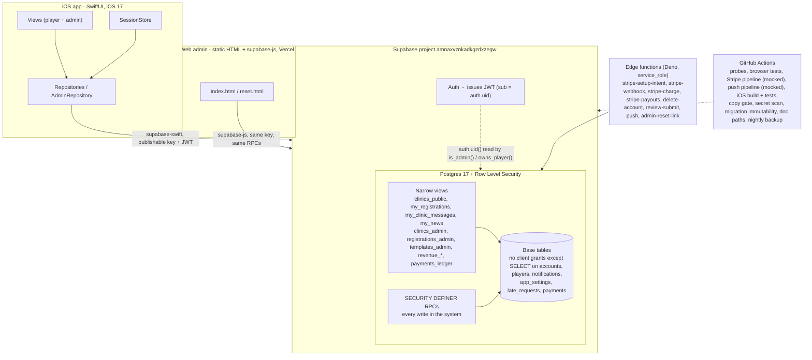

# FXE Tennis: Architecture

The one document to read before touching this system. Written for a product
manager or a new engineer who needs to understand what FXE Tennis is, how it is
built, and, just as important, what is deliberately not built yet.

Regenerated 2026-09-01 from the live schema, the file tree, and the probe
suite; refreshed by hand 2026-09-12 after the docs audit (payments, the
ledger, the 4-hour cancel, push groundwork, and every count). The previous
version (2026-08) predated sign-up, the admin tab, the live web admin, late
requests, templates and the explicit-grants work. Where this
document and the code disagree, the code wins and this file gets fixed; the
changelog in `CLAUDE.md` is the day-by-day record.

> This is **FXE Tennis**, a clinic-registration app for a single tennis pro
> (Tara) and her members. It is a separate product from Volee. Where a design
> choice was learned from Volee it is noted, but the two share no code and no
> database.

---

## 1. What FXE Tennis is

Tara runs weekly tennis clinics at a member club. Until now she ran them from
text messages, a spreadsheet, and a handwritten court sheet. FXE Tennis replaces
that notebook.

A **player** browses the clinics coming up, registers, and either lands a spot
(`You're In!`) or joins the **Player Pool**. Tara, the single **admin**, builds
the weekly schedule, decides who comes off the Pool, assigns courts, sends
clinic messages, and reconciles who has paid. The app manages information; Tara
manages tennis. Nothing is ever auto-promoted off the Pool: she picks every
player by hand, on purpose.

The product has three surfaces on one backend:

- **The player iOS app** (SwiftUI). Section 4.
- **The admin tab inside that same app**, for what Tara does standing on a
  court: rosters, invitations, courts, paid, reminders, late requests, the
  player directory. Section 4.
- **The web admin**, a static page for the laptop half of her week: building
  clinics from templates, Action Needed, Money, and the same directory. Live
  at `fxe-tennis-admin.vercel.app`. Section 8.

Everything of consequence, every rule about who can see what and who can do
what, lives in the Postgres database, not in any client. That is the single
most important thing to understand here, and it is section 5.

---

## 2. Status at a glance

| Area | State |
|---|---|
| Postgres schema, RLS, narrow views, RPCs | **Built**, 53 migrations. Which of them are on hosted is `supabase migration list --linked`, recorded after each push in `docs/whats-next.md` (49 of 49 paired on 2026-09-28); `20260928500001_uninvite_message.sql` goes with its PR, and `20260928800001_player_history.sql` and `20260928800002_copy_week.sql` with theirs (decision 0027), and `20260929000001_canceled_drafts_stay_hidden.sql` (a canceled draft never reaches a player) |
| Security model (explicit grants, revoked base tables, admin gate, anon executes nothing) | **Built**, enumerated by probes |
| Pricing (member/non-member x 60/90 min), snapshot, revenue report | **Built** |
| SQL probe suite (38 probes; the suite prints its own total) + concurrency probe, in CI | **Built** |
| iOS: sign-in, sign-up with profile, password reset, three tabs | **Built** |
| iOS: browse by week, per-viewer pricing, register / cancel (inside the 3-hour cutoff the full fee applies; the note is optional) / leave pool / respond, closed-clinic "Message Tara", the bell, My Clinics, profile edit, card on file | **Built** |
| iOS admin tab: rosters, invite, courts, paid, unpaid reminder, message audiences, late requests, Action Needed (open disputes too, since 2026-09-28), player directory | **Built** |
| Web admin: clinic + template CRUD (archive, never delete), rosters, walk-up, courts, reminder, Action Needed, Money with the card ledger, Payouts and dispute alerts (2026-09-28, not yet deployed), directory, password reset | **Built**, live on Vercel |
| Nightly `pg_dump` backup + keep-warm | **Built**, first artifact 2026-09-01 |
| APNs push delivery | **Built, waiting on the key** (decision 0008). Client half: permission sheet, registration, `register_device`; since 2026-09-27 also receiving (MVP audit item 12): a push that lands while the app is open shows as a banner and reloads Home, a tap opens its clinic through the same resolver as the bell (`NotificationRouter.swift`), and the icon's number is the bell's count, cleared at sign-out. Checked on the simulator with `tests/push/simctl-push.sh`, which pushes the payload the sender builds. Sender (2026-09-23): trigger `push_on_notification` → pg_net → the `push` edge function → APNs, with `delivered_at` / `delivery_error` on each row, proven against a mock by `tests/push/run.sh`. Since 2026-09-28 the payload also carries `category: INVITATION` on an invitation (the category the app registers Accept and Decline under, `FXETennis/App/InvitationActions.swift`, 2026-09-28) and `thread-id`, the clinic's id, on every row about a clinic, so the lock screen groups them. Nothing is sent until Apple issues the key and the two vault secrets exist (`supabase/functions/README.md`, "What Alex does when the key arrives") |
| Stripe card payments | **Built, switched off** (decision 0009): ledger, RPCs, three edge functions ACTIVE on hosted, card screen, `payments_ledger`. Since 2026-09-28 (branch `payouts-disputes`, not yet on hosted): `stripe-payouts` (Tara's Payouts card) and chargebacks recorded from `charge.dispute.*` webhooks (`stripe_record_dispute`, `admin_money_disputes`), a lost one subtracted from Charged and Collected. `app_settings.payments_enabled` is `false`; nothing charges until the Stripe keys are set (launch checklist A1); her policy answers landed 2026-09-16 and 2026-09-21 (decisions 0012, 0013). The sandbox-to-live switch is `stripe_cutover_to_live()`, run once by a person at the key swap (20260927200001; procedure in `supabase/functions/README.md`) |
| Juniors / parent accounts | **Deferred** to November or the spring session (decision 0007) |
| App Store / TestFlight | **Blocked** on Apple Developer enrollment for FXE Tennis, LLC |

---

## 3. System diagram


```mermaid
flowchart TD
    subgraph ios["iOS app  -  SwiftUI, iOS 17"]
        views["Views (player + admin)"]
        session["SessionStore"]
        repos["Repositories / AdminRepository"]
        views --> repos
        session --> repos
    end

    subgraph web["Web admin  -  static HTML + supabase-js, Vercel"]
        page["index.html / reset.html"]
    end

    repos -->|"supabase-swift, publishable key + JWT"| supa
    page -->|"supabase-js, same key, same RPCs"| supa

    subgraph supa["Supabase project amnaxvznkadkgzdxzegw"]
        auth["Auth  -  issues JWT (sub = auth.uid)"]
        subgraph pg["Postgres 17 + Row Level Security"]
            vws["Narrow views<br/>clinics_public, my_registrations, my_clinic_messages, my_news<br/>clinics_admin, registrations_admin, templates_admin, revenue_*, payments_ledger"]
            rpc["SECURITY DEFINER RPCs<br/>every write in the system"]
            tbl[("Base tables<br/>no client grants except SELECT on accounts, players, notifications,<br/>app_settings, late_requests, payments")]
            vws --> tbl
            rpc --> tbl
        end
        auth -.->|"auth.uid() read by is_admin() / owns_player()"| pg
    end

    edge["Edge functions (Deno, service_role)<br/>stripe-setup-intent, stripe-webhook, stripe-charge, stripe-payouts, delete-account, review-submit, push, admin-reset-link"]
    edge --> pg
    gha["GitHub Actions<br/>probes, browser tests, Stripe pipeline (mocked), push pipeline (mocked), iOS build + tests,<br/>copy gate, secret scan, migration immutability, doc paths, nightly backup"] -.-> supa
```

The phone and the web page are two clients of one API. Postgres cannot tell
them apart and does not need to, because it never trusts the caller.

---

## 4. The client (iOS app)

Tara's two AI-made mockups live in `media/` (`FXE 1@2x.png`, `FXE 2@2x.png`, with PDFs). They are a style guide, never a spec (CLAUDE.md, "On the wireframe mockups"); there are no wireframes of the screens as built, and the screenshot set per TestFlight upload (`docs/launch-checklist.md` §C) will be the record of what shipped.

SwiftUI, deployment target **iOS 17.0**. iPhone only for v1. Two dependencies
(`project.yml`): **supabase-swift** (2.41.1, pinned), configured for the
*implicit* auth flow because the password-reset email must be finishable in a
browser on another device (PKCE binds the one-time code to the device that
asked); and **stripe-ios**, PaymentSheet only, so a card number never touches
our code. Light appearance is forced at the root; the palette has no dark
variant.

### Project generation: XcodeGen

The `.xcodeproj` is **generated** from `project.yml`, never hand-edited and
never committed. `xcodegen generate` globs `FXETennis/`, so a new `.swift` file
is picked up with no "add to target" step. CI regenerates on a fresh clone, so
a broken `project.yml` fails there first.

### Layering

```
FXETennis/
├── App/
│   ├── FXETennisApp.swift       @main; RootView switches on session.phase; forces .light;
│   │                            returning to the app refreshes the session (scenePhase)
│   ├── Session.swift            SessionStore: auth, account, activePlayer, isAdmin,
│   │                            signUp → create_my_account, password reset; a failed load keeps
│   │                            who you are (no answer is not "no profile"), `.loadFailed` at launch;
│   │                            reopen(.waiver / .card) when register_for_clinic refuses;
│   │                            a generation counter drops a load that outlives a sign-out,
│   │                            and a load with the stored session gone signs out (unit-tested)
│   ├── PushRegistrar.swift      client half of decision 0008: permission (once, Tara's line),
│   │                            APNs registration, token → register_device; sends nothing.
│   │                            PushAppDelegate is also the notification center's delegate:
│   │                            banner + Home reload in the foreground, taps to the router;
│   │                            setBadge / syncBadge keep the icon at the bell's count;
│   │                            no banner while signed out; the icon cleared after sign-out;
│   │                            registers the INVITATION category at launch and hands its
│   │                            Accept / Decline to InvitationActions
│   ├── NotificationRouter.swift where a tapped notification goes, bell and push alike:
│   │                            'clinic' or 'registration' → my_registrations or, for Tara,
│   │                            registrations_admin → the player's clinic page or hers;
│   │                            the push-tap sheet (pushTapRouting), which keeps a tap pending
│   │                            while another sheet is up and marks it read once shown
│   ├── InvitationActions.swift  Accept and Decline on the invitation push itself (2026-09-28):
│   │                            only those two buttons answer (hard rule 2), in the background,
│   │                            through respond_to_invitation; the row read and the icon synced;
│   │                            a changed invitation gets Tara's "beat you to the punch" line, no
│   │                            signal (or no answer within 20 s) the connection line, as a
│   │                            notification that opens the clinic; nobody signed in hands the
│   │                            push to the app (unit-tested)
│   ├── RegistrationReminders.swift the notification-center half of "Remind me": set, cancel, what
│   │                            is waiting; reconciled with each fresh clinic list (Home, Clinics),
│   │                            dropped by the clinic page once she holds a spot; all removed at
│   │                            sign-out and when a launch finds the session ended by the server
│   ├── NextClinicIntent.swift   "Hey Siri, when's my next clinic?": the App Intent and its phrases, run
│   │                            in the app's process through ClinicsViewModel (snapshot when offline)
│   └── AppEnv.swift             DEBUG vs release: local stack vs hosted, reset URL
├── Data/
│   ├── SupabaseClient.swift     the one client (URL + publishable key, implicit flow)
│   ├── Repositories.swift       player reads/writes: Clinic, Registration, News, Profile
│   ├── PaymentsRepository.swift asks stripe-setup-intent for what PaymentSheet needs; that is all
│   ├── Snapshot.swift           instant open (decision 0028): the last good answer per signed-in person,
│   │                            shown at launch and refreshed behind; removed at sign-out (unit-tested)
│   ├── AdminRepository.swift    every admin RPC + the roster/late-request/notice models, the money
│   │                            models (MoneyClinic, MoneyDecline, MoneyDispute) and Stripe's decline codes in words
│   └── RequestFailure.swift     what a request met, by URLError code, HTTP status or Postgres code:
│                                unreachable / rate limited / cancelled / an answer; a PostgrestError
│                                with no code is the gateway, so unreachable (unit-tested)
├── Models/
│   ├── CoreModels.swift         Codable mirrors of the views (no hidden columns exist here)
│   ├── CancelPolicy.swift       decision 0010: is this cancel inside cancel_cutoff_hours? (pure, unit-tested)
│   ├── NextClinic.swift         the answer Siri gives: the soonest clinic held, its club-time day and the status words (pure, unit-tested)
│   ├── ClinicCalendarEvent.swift "Add to Calendar": offered while You're In! before the start; the
│   │                            name and times in America/New_York, and nothing in location, URL
│   │                            or notes, hard rule 1 (pure, unit-tested)
│   ├── NTRPRating.swift         the USTA scale for the "?" explainer
│   ├── NotificationCopy.swift   Tara's notification catalogue, verbatim
│   ├── PlayerHistory.swift      decision 0027: admin_player_history's row and its line, "12 played ·
│   │                            1 no-show · 2 late cancels" or "New", for the Pool rows and the
│   │                            player page (pure, unit-tested)
│   ├── RegistrationMoments.swift when a clinic's registration changes on its own (opening, close,
│   │                            start), for TimelineView redraws; `door`: what the clinic page
│   │                            and card offer someone not registered (pure, unit-tested)
│   ├── RegistrationReminder.swift "Remind me": goes off at this player's opening (member_opens_at
│   │                            or public_opens_at), Tara's notification 10 verbatim, a tap opens the
│   │                            clinic; what to move or drop when a list loads (pure, unit-tested)
│   └── ServiceWeek.swift        Sunday-in-New-York week math for grouping (pure, unit-tested)
├── Resources/
│   └── Brand.swift              tokens: navy / cream / court / brass, type, spacing, the gator mark;
│                                type scales with Larger Text through UIFontMetrics (unit-tested)
└── Views/
    ├── AuthView.swift           sign in, create account, forgot password
    ├── CompleteProfileView.swift name, phone, membership question, rating (after sign-up)
    ├── NotificationPermissionView.swift shown once after the profile exists, before iOS's own dialog;
    │                            Tara's Screen-3 sentence, two equal buttons
    ├── MainTabView.swift        Home, Clinics, Profile, plus Manage when isAdmin
    ├── HomeView.swift           the front page (decision 0015): My Clinics on top, then what is open for
    │                            registration while fewer than two are yours, else the one blue button; the bell
    ├── NotificationsView.swift  what the bell opens: rows the RPCs wrote, newest first, mark read;
    │                            a row opens its clinic through NotificationRouter, and while open
    │                            the list takes tapped pushes and reloads when one lands
    │   (NotificationPermissionView.swift also holds NotificationsOffLine: the standing line on Home while permission is denied)
    ├── MyClinicsView.swift      the clinics I hold a live registration in, grouped by week, with chips,
    │                            then Past: what I played and what it cost me (my_past_clinics)
    ├── ClinicsView.swift        the list, grouped This week / Next week / Week of …
    ├── ClinicDetailView.swift   register / cancel / leave pool / respond, confirmations,
    │                            "Message Tara" once the clinic has closed; Add to Calendar under
    │                            You're In!, Remind me before the opening; a success haptic when a
    │                            registration lands, a warning when it is refused
    ├── ClinicExplainerSheet.swift the "?" sheet (Tara's descriptions + the 105 definition)
    ├── ProfileView.swift        the player's own details, Payment method (only while payments are on), version, sign out, Delete my account
    ├── EditProfileView.swift    name, phone, rating; membership shown as Tara's to correct
    ├── CardOnFileView.swift     the permission box (their words), the card as •••• 4242, or Add a card → Stripe's PaymentSheet; after it, CardSavePoll waits about 30 s for the webhook's summary, then Refresh
    ├── CardStepView.swift       onboarding after the waiver while cards are required: the card screen as a step, Sign out as the exit
    ├── Components/BrandHeader.swift the straight navy header with the green line, the Wordmark, NavRowLabel
    ├── Components/CourtBackdrop.swift Tara's court photo under a porcelain wash, behind the main screens
    ├── Components/AccountExitFooter.swift Sign out and Delete my account (Profile's dialog) at the foot of
    │                            every onboarding step: the profile form, the waiver, the can't-load screen
    ├── Components/ReloadOnForeground.swift ReloadThrottle and .reloadOnForeground: screens reload when
    │                            the app returns, at most once per 30 seconds (unit-tested)
    ├── Components/AddToCalendarSheet.swift Apple's New Event editor (EventKitUI), prefilled by
    │                            ClinicCalendarEvent; runs outside the app, so no calendar permission
    ├── Components/StatusChipMotion.swift the status chip changes over 0.35 s, a crossfade only under
    │                            Reduce Motion, and leaves at once when it goes (unit-tested)
    ├── Components/LoadingPlaceholders.swift the list's shape instead of a spinner on a first load (cards on
    │                            Clinics and My Clinics, rows on Home); a slow fade, none under Reduce Motion
    ├── LoadFailedView.swift     signed in but the profile could not load: the connection line, Try again, Sign out
    ├── WaiverView.swift         Tara's waiver, her checkbox sentence, the typed legal name; gates the app until signed;
    │                            Try again when it fails to load, Sign out / Delete at the foot
    ├── AdminClinicsView.swift   Manage: Action Needed (a clinic ended and not charged yet, a declined
    │                            card, each opening its clinic; an open dispute, opening Stripe;
    │                            "N unpaid" only while zelle_allowed),
    │                            Today, Upcoming, Past; toolbar → Players
    ├── AdminClinicDetailView.swift roster: courts, Came/No-show, Late cancel (inside the cutoff), invite,
    │                            cancel invite, late requests, Message Players, Charge clinic and its summary
    │                            from Stripe's answer (ChargeSummary, ChargeOutcome); late cancels on the
    │                            Canceled list with their note (Paid and Remind unpaid only while zelle_allowed)
    └── PlayersDirectoryView.swift search, member / active switches, private note
```

Four ideas run through the client code:

1. **One Supabase client.** The publishable key ships in the binary on purpose:
   it grants only what the grants and RLS allow. Every real permission lives in
   Postgres.
2. **Repositories are the only door to the network.** Views never touch
   `supabase` directly. One place to change when an RPC changes, and one place
   a reviewer can confirm the client never reads a hidden table.
3. **Models mirror the views, and absence is a feature.** `CoreModels.swift`
   has no field for capacity, counts, or other players, because those columns
   are not in the views the client reads. The app cannot display a hidden fact
   even by accident. (`AdminRepository`'s models are the exception, and they
   are fed by admin-only views and RPCs that return zero rows to a player.)
4. **`SessionStore` is the injected identity.** `RootView` switches on
   `session.phase` (`loading` / `signedOut` / `needsProfile` / `signedIn`).
   `needsProfile` exists because Supabase sign-up creates only an auth user;
   `create_my_account` creates the `accounts` and `players` rows with the
   caller's `auth.uid()` as the id and `role` hard-coded to `member`.

Copy rule (hard rule 13): every user-visible string is either Tara's verbatim
or plain chrome checked by Alex. `scripts/extract-copy.py` snapshots every
string the extractor can see (direct `Text` / `Button` / `Label` literals and
HTML text nodes) into `docs/copy-approved.txt`; CI fails on one of those that
is not in the snapshot; `docs/copy-review.md` is where new ones wait. Strings
in ternaries, `return`s, assignments and JS template literals are invisible to
it, which is a known gap (`docs/backlog.md`, 2026-09-12), not a guarantee.

---

## 5. The backend (Supabase / Postgres) and its security model

### Hosted project

- **Project ref** `amnaxvznkadkgzdxzegw` (`fxe-tennis`, `us-east-1`),
  Postgres 17, free tier. Free-tier projects pause after a week idle; the
  nightly backup job doubles as the keep-warm.
- **Local development** uses the Supabase CLI pinned to **2.115.0** (also in
  CI; a version drift hid a broken grant surface for days). `supabase db reset`
  applies every migration then `supabase/seed.sql`.
- **Migrations** in `supabase/migrations/` apply in filename order and are
  pushed to hosted only with `supabase db push`. An applied migration is
  never edited, only superseded; CI enforces it.

### The central security rule, in plain terms

Nine things are hidden from players:

> clinic capacity, number registered, spots remaining, Player Pool size, other
> players' names, court assignments, other players' payment status, private
> coaching notes, and clinic location.

None of that can be enforced in a client: anyone with a proxy reads the raw
JSON. The hiding is done in the database by three mechanisms:

1. **Grants are explicit, in both directions.** Supabase's bootstrap gives new
   tables and views full privileges for `anon` and `authenticated`, and
   Postgres gives PUBLIC `EXECUTE` on every new function. Every migration
   therefore revokes before it grants (hard rule 11), and `authenticated` is
   granted exactly (`information_schema.table_privileges` and
   `column_privileges`, 2026-09-12): `SELECT` on `accounts`, `players`,
   `notifications`, `late_requests`, `payments` and `app_settings` (RLS scopes
   the first five to the caller; settings are player-safe by rule; on
   `notifications` the SELECT is a column list since 20260923000001, so the
   push audit columns `delivered_at` and `delivery_error` are withheld), column
   `UPDATE` on `accounts(first_name, last_name, phone)`,
   `players(first_name, last_name, adult_rating, date_of_birth)` and
   `notifications(read_at)`, `SELECT` on the narrow views, and `EXECUTE` on the
   client RPCs. `anon` holds nothing: no table, no view, no function. `tests/sql/grants_are_explicit.sql`
   enumerates `pg_class` and `pg_proc` rather than naming objects, so an
   object added next month is covered before anyone remembers to list it.
2. **Narrow views** expose exactly the safe columns:

   | View | What it is | Who sees what |
   |---|---|---|
   | `clinics_public` | Published/canceled clinics that have not ended, both price rates, no capacity or counts | any authenticated user |
   | `my_registrations` | The caller's own registrations (no court, no `canceled_by`) | scoped by `owns_player()` |
   | `my_clinic_messages` | `everyone` messages for your clinics plus targeted messages sent to you | scoped to the caller |
   | `my_news` | Published news for your audience with a per-account read flag | scoped to the caller |
   | `clinics_admin`, `registrations_admin`, `templates_admin` | Explicit column lists (never `select *`, which freezes at creation) `where is_admin()`. `registrations_admin` adds the computed `has_card` and `charge_status` so the roster can offer Charge | admin only, else zero rows |
   | `revenue_by_clinic`, `revenue_by_segment` | Reconciliation aggregates | admin only |
   | `payments_ledger` | Card payments with player and clinic named (2026-09-12): `id, kind, amount_cents, currency, status, failure_reason, created_at, updated_at, registration_id, refunds_payment_id, account_id, first_name, last_name, clinic_id, clinic_name, clinic_starts_at, failure_code, livemode, dispute_status` (`failure_code` appended 2026-09-26, 20260926000010; `livemode` 2026-09-27, 20260927200001, which also hides test-mode rows once `app_settings.stripe_live_since` exists; `dispute_status` 2026-09-28, 20260928200001). Exists because `registrations` is unreadable to clients on purpose, so PostgREST cannot embed through it | admin only |

   Views run with owner rights (not `security_invoker`), which is why writes
   through them are revoked outright: an auto-updatable view would bypass RLS.
3. **`service_role` is the one trusted writer.** Edge functions use it to write what no client may (ledger status, card summaries). It bypasses RLS by design and holds DML on every table by explicit grant (20260912000002) after the PUBLIC revokes had silently taken that away; the grants probe pins it.
4. **RLS on the base tables** as defense in depth. The grants are the
   load-bearing control; the policies catch what a grant mistake would miss.

### Who is an admin, who owns a player

- **`is_admin()`**: the caller's `auth.uid()` maps to an `accounts` row with
  `role = 'admin'`. The admin views are `… where is_admin()`, so that
  predicate is their entire access control.
- **`owns_player(player)`**: the player belongs to the caller's account. This
  scopes `my_registrations` and every player-facing RPC.
- **`require_admin()`** raises `42501` unless `is_admin()`; every admin RPC
  opens with it.
- **Becoming admin.** `role` is never a parameter anywhere. A BEFORE INSERT
  trigger (`bootstrap_first_admin`) promotes exactly one email, Tara's, at
  account creation, so she self-serves on the live site and nobody else can.

### The privilege-column protection

A player could once `update accounts set role = 'admin'`. Migration
`20260802000003` closed it three ways, any one sufficient: column-level
grants (`authenticated` may update `accounts`: name and phone; `players`: name,
rating, date of birth; never `is_member`, `role` or `account_id`), `WITH CHECK` pinning
identity columns, and triggers (`guard_account_privilege_columns`,
`guard_player_owner_column`). `tests/sql/privilege_escalation.sql` performs
the attack and asserts it fails.

### The tables

| Table | What it holds |
|---|---|
| `accounts` | Login identity. `role` is `member` or `admin`. One row per `auth.users` row, created by `create_my_account`. Also `stripe_customer_id` and the card *summary* (`card_brand`, `card_last4`, `card_added_at`), written only by the webhook, so a player cannot forge one. |
| `players` | One row per person who can be registered. `adult_rating`, `is_member` (self-reported, corrected by Tara), `is_active` (archive, never delete). |
| `player_notes` | Tara's private note per player. Reached only through `admin_player_note` / `admin_set_player_note`. |
| `clinic_templates` | Reusable definitions; prices derive from duration via `default_price_cents`. |
| `clinics` | A scheduled clinic: capacity, both prices, `member_opens_at` / `public_opens_at` / `closes_at` (defaults from triggers: windows from the service week, close 3 h before start), `status`. |
| `registrations` | Clinic × player with `status`, `paid`, `court_number` (1-5), `source`, the price snapshot (`price_cents_charged`, `was_member`, `duration_minutes`), and since 20260912000005 `late_cancel` + `cancel_note` (decision 0010). |
| `late_requests` | "Can I still get in?" after the close; Tara approves or declines. |
| `clinic_messages` + `clinic_message_recipients` | Broadcasts; targeted audiences are snapshotted at send time. |
| `news_posts` + `news_reads` | Announcements; read state per account. |
| `notifications` | In-app rows written by RPCs (players and Tara). Readable by the owner, eight named columns; only `read_at` is writable. `delivered_at` / `delivery_error` are written by the `push` edge function and readable by no client (20260923000001). Every insert fires `push_on_notification`, which posts the row id to `push` through pg_net once the vault secrets `push_function_url` and `push_webhook_secret` exist, and does nothing until then. |
| `devices` | APNs tokens (groundwork; nothing delivers yet). |
| `my_past_clinics` (view) | A player's own finished clinics with only their own outcome: name, time, status, no-show, late, price snapshot, paid. Own rows only, none of the nine hidden facts (feature review 09-02; decision 0012 §10). |
| `card_consents` | One row per card permission (decision 0015 §7): the server's copy of the words, their version, the time, the app build. Written only by `record_card_consent`; read by `my_card_consent` and by `stripe-setup-intent`, which refuses a card setup without one; kept while the account exists and 90 days after `deleted_at`, then removed by `purge_expired_card_consents()` from the nightly `retention` job. No client privilege |
| `waivers` + `waiver_acceptances` | Tara's Adult Tennis Participation Waiver, one row per version, and each electronic signature (typed legal name, account email, time, app build). Reached only through `current_waiver`, `my_waiver_accepted`, `accept_waiver` (decision 0013). A signature RESTRICTs a hard delete of its account (20260927200002), as a card consent does: nothing deletes a signature. |
| `payments` | The money ledger (decision 0009): one row per clinic fee, late cancel, no show or refund, with Stripe ids and a status only the edge functions or admin RPCs change. On a decline, `failure_reason` is Stripe's sentence and `failure_code` its machine code (`decline_code`, else `code`: `insufficient_funds`, `expired_card`, ..., 20260926000010), both written only by the Stripe edge functions. `livemode` is Stripe's own flag for the row's PaymentIntent or Refund (20260927200001): false (test mode) is never money, so the board report skips it and it never moves the Paid flag; since 20260927300001 it also stops counting as a charge anywhere once the club has switched to live (`payment_is_real`), and the one-charge unique indexes skip it. `first_attempted_at` (20260927300003) is stamped by `stripe-charge` at a row's first claim and measures the retry window; no client role can read or write it, so players read their own rows through a column-level SELECT of every other column. Chargebacks (20260928200001): `stripe_dispute_id`, `dispute_status` (Stripe's word), `dispute_reason`, `dispute_amount_cents` (what the bank disputes), `dispute_withdrawn_cents` (what Stripe actually took from the balance for it, from the dispute's balance transactions: nothing for an inquiry, a won dispute, or a charge already refunded), `disputed_at`, `dispute_due_by` (Stripe's respond-by) and `dispute_event_at` (the event that last wrote them), written only by `stripe-webhook` through `stripe_record_dispute`; not in the column list, so no client reads them, not even the payer (who can see `updated_at` move); a check constraint refuses a status without its id, amounts and event time. One dispute per payment. |
| `app_settings` | Small admin-editable strings, e.g. Tara's payment line, and the payment policy keys (`payments_enabled`, `cancel_cutoff_hours`, …). `stripe_live_since` appears only when `stripe_cutover_to_live()` has run. Never anything hidden. |
| `review_links` | One row per link to Tara's review page (`web/review.html?t=<token>`, 20260921000010). The token is the credential: 24 random bytes, URL-safe, minted by `admin_create_review_link`; `revoked_at` retires a link without deleting what it collected. No client role holds anything on it. |
| `reset_links_issued` | One row per password-reset link Tara makes for a member (decision 0017): whose account, who made it, when. Written by the `admin-reset-link` edge function as `service_role` before the link exists; no client privilege. Audit only: a reset link signs whoever opens it in as the member |
| `review_responses` | Her answers, one jsonb blob per (link, page version), replaced on every save; `updated_at` stamped by trigger with `clock_timestamp()`. Written only by the `review-submit` edge function as `service_role`, read back by `admin_review_responses`. |

Enums: `account_type`, `account_role`, `player_kind`, `clinic_audience`
(`juniors` kept, not offered), `clinic_status`, `registration_status`
(`in` / `pool` / `response_needed` / `canceled`), `message_audience`,
`news_audience`, `news_status`, `registration_source`, and since decision 0009
`payment_kind` (`clinic_fee` / `late_cancel` / `no_show` / `refund`) and
`payment_status` (`pending` / `processing` / `succeeded` / `failed` /
`canceled`).

### The RPCs

**Player-facing** (self-gated by `owns_player()` or `auth.uid()`):
`create_my_account`, `register_for_clinic` (refuses `card_required` once payments are on unless a card is saved, meaning `card_last4` and not merely a Stripe customer; `waiver_required` until the current waiver is signed; `back_to_back_105` for a non-member taking a second 105 the same New York day earlier than 48 hours before the earlier start, decision 0015, using `is_105` and `back_to_back_105_opens_at`; since 20260928000001 it tells the player in Tara's words, #1 You're In with the New York day and time or #5 Added to Player Pool), `record_card_consent` / `my_card_consent` / `card_consent_text` (the permission box, decision 0015 §7), `respond_to_invitation` (an accept sends the player her #3, never #1 as well, and not at all once Tara has canceled the clinic; the admins read "{player} accepted their spot in {clinic}." or "{player} declined {clinic} and is back in the Player Pool.", 20260928000001),
`cancel_registration(p_registration, p_note)` (inside the 3-hour cutoff the cancel is late and the fee applies; the note is optional, decisions 0012/0013; the admins are told only when the caller owns the player, "{player} canceled {clinic}." plus the late and note suffixes, so Tara's own removal no longer reads in her Action Needed as the player canceling, 20260927100002; since 20260928000001 Tara removing someone from the Player Pool of a published clinic sends them her #6, and her removal from You're In! still tells nobody), `leave_pool` (archives the row as canceled since 2026-09-21), `request_late_spot`,
`mark_news_read`, `register_device` / `unregister_device` (the account is
always `auth.uid()`; `devices` stays client-unreadable), `current_waiver` / `waiver_version` / `my_waiver_accepted` / `accept_waiver` (the waiver, decision 0013 §4), `delete_my_account` (scrubs the person, keeps history; the `delete-account` edge function then removes the sign-in through Supabase's admin API, decision 0013 §5), `zelle_allowed` (false: the card is the only way to pay).

**Admin** (each opens with `require_admin()`):

| RPC | What it does |
|---|---|
| `admin_upsert_clinic`, `admin_upsert_template`, `admin_set_template_archived`, `create_clinic_from_template` | Build the week. Templates are copy-on-create; archived, never deleted (`admin_delete_template` remains but the web admin no longer offers it). |
| `publish_clinic`, `cancel_clinic` | Draft to published; cancel and notify everyone live. |
| `invite_from_pool`, `cancel_invitation` | Tara's hand-pick, and taking it back. |
| `admin_mark_late_cancel` | Tara records a late cancellation for someone who told her (a text an hour before; 20260927100002): You're In! to Canceled, `late_cancel` set, `canceled_by` her, optional note; Charge clinic then charges it as a late cancel. Only inside the cutoff or later (`not_late_yet`), never once the row is charged (`charged_refund_first`) or on a canceled clinic; tells nobody. Her plain Remove (`cancel_registration`) stays free. |
| `resolve_late_request` | Put a late asker in, or say no room. |
| `place_player` | Walk-up placement; ignores window and capacity by design; still snapshots the price. Since 20260928000001 it sends the player Tara's #1 when this placement is what put them in: not when they were already in, not for a draft, canceled or already-started clinic, and not when it is `resolve_late_request` placing an approved late asker (that answer is its own row). It reads the clinic row `FOR UPDATE`, the lock `register_for_clinic` takes, and the player's live row `FOR UPDATE`, so "already in" is exact under a double tap or a simultaneous Accept. |
| `set_paid`, `assign_court` | The court sheet. `assign_court` is the one unconditional update in the schema: a court is a value, not a transition. |
| `send_clinic_message` | Audiences `everyone` / `in` / `pool` / `response_needed` / `unpaid`, resolved server-side. The one-tap unpaid reminder is this with a fixed body. |
| `search_players`, `admin_player_note`, `admin_player_note_edited`, `admin_set_player_note`, `admin_set_membership`, `set_player_active` | The directory. `search_players` returns `has_notes`, never the note; `admin_player_note_edited` returns the note's `updated_at` or null (20260912000004). |
| `admin_player_history` | A player's history at a glance (decision 0027 §1; 20260928800001): per player, clinics played (the board report's attended: You're In!, not a no-show, clinic ended and not canceled), no-shows (the same rows, flagged), late cancellations (in a clinic not canceled, counted when they happen) and the start of the last clinic played. Every player with no argument, one player with `p_player`; a row of zeros is "New". Nothing in a canceled clinic counts. |
| `admin_copy_week` | Copy to next week (decision 0027 §2; 20260928800002): every clinic of the service week starting on `p_week_start` (a Sunday, else `not_a_sunday`), canceled ones aside, copied to the next week as drafts on the same New York wall clock (local time plus 7 days, never 168 hours); windows, close and prices recomputed for the new date as for any new clinic; registrations, courts and messages never copied. Skips a clinic whose copy exists (same name, same start, not canceled), under an advisory lock on the target week, so a double click makes nothing twice; returns `(created, skipped)`. |
| `publish_news` | Publish a draft post. |
| `admin_charge_registration`, `admin_refund_payment` | Insert `pending` ledger rows for the Stripe edge functions to execute; refuse while `payments_enabled` is false. Since 20260927100001, **one fee per player per clinic**: a charge is refused (`already_charged`) while the player holds a live fee in that clinic on any of their rows, of any kind (live = pending, processing, or succeeded and not refunded in full), checked under a per player-and-clinic advisory lock. |
| `admin_set_no_show`, `admin_charge_clinic` | Came or No-show on a You're In! row, refused once that row holds a live fee (`charged_refund_first`: refund first); her one tap per ended clinic (decision 0012), which refuses a canceled clinic (`clinic_canceled`), skips a late cancel when the same player holds a You're In! row there, and locks the clinic's rows while it charges (20260927100001). Since 20260927300001 it refuses a clinic that ended before `app_settings.payments_enabled_at`, and every clinic while that is empty (`clinic_before_payments`), and skips a row Tara marked Paid that holds no live fee. |
| `admin_resolve_held_payment` | Tara records what Stripe shows for a held charge (processing with `idempotency_error` or `retry_window_passed`, which `stripe-charge` will never retry): `succeeded` (through the same Paid trigger the webhook fires) or `canceled` (frees the charge). Anything else is `payment_not_held` (20260927300003). |
| `revenue_summary` | The four numbers and the money (section 7). Since 2026-09-27 the web admin reads only its four counts; the money comes from `admin_money_summary`. Kept (hard rule 6). |
| `admin_money_summary`, `admin_money_clinics`, `admin_money_declined` | The Money numbers from the ledger (20260927100003): charged (succeeded fees minus their succeeded refunds, all time: the board report's collected without dates), declined and not charged yet for ended, not canceled clinics; per clinic, with how many not-charged players have a card (what one more Charge clinic would charge); and the declined list with the cardholder's name, the clinic and Stripe's code. One definition, the internal `money_rows()`, which the three only aggregate. Since 20260927300001 only clinics ending at or after `payments_enabled_at` owe anything, a row Tara marked Paid with no live fee is settled, the declined list carries `account_deleted` (Action Needed leaves those out), and the web's This week tab keeps exactly the clinics these say are chargeable or declined. Since 20260928200001 charged also subtracts what Stripe withdrew for every **lost dispute** on a fee it counts (`dispute_withdrawn_cents`, so a charge already refunded loses nothing twice); open and won disputes subtract nothing, and `money_rows` is unchanged, so a lost dispute keeps the fee charged and Charge clinic never charges that player again. |
| `admin_money_disputes` | Open chargebacks (20260928200001): every payment whose `dispute_status` is not `won`, `lost` or `warning_closed`, with the cardholder's name, the clinic, the disputed amount, Stripe's reason, status and respond-by, soonest respond-by first; test-mode disputes by `payment_is_real`. Web and phone Action Needed show each as "{name} disputed a charge" with a link to Stripe. |
| `stripe_record_dispute` | Not a client RPC: `service_role` only, SECURITY INVOKER (20260928200001). `stripe-webhook`'s writer for `charge.dispute.created` / `.updated` / `.closed`: finds the fee by its PaymentIntent (never a refund row), else by the row the PaymentIntent's metadata names while that row has no PaymentIntent (a held charge Tara marked "Went through"), and writes the eight dispute columns unless the event is older than the one recorded, is a non-decision for a dispute already decided (won, lost, warning_closed), or is a different dispute on a payment whose dispute was lost (`second_dispute`: the lost one and its money stay). The guards are in the UPDATE's WHERE, so a concurrent delivery re-checks them on the locked row (`dispute_race.sh`). Answers `recorded`, `stale`, `second_dispute` or `no_payment`; never touches status, amount, the Paid flag or another row. |
| `stripe_cutover_to_live` | Not a client RPC: postgres and `service_role` only (20260927200001). Run once at the sandbox-to-live key swap: clears every account's Stripe customer and card summary, cancels ledger rows still pending or processing (`live_cutover`), marks rows with no recorded mode as test mode, records `app_settings.stripe_live_since`; refuses a second run (`already_live`) and refuses once a live payment exists (`live_payments_exist`). |
| `admin_board_report`, `admin_board_report_clinics` | The board report (Tara, 2026-09-26; 20260926000010): for New York dates `p_from..p_to` inclusive, attendances and distinct players by the `was_member` snapshot (You're In!, not a no-show, clinic ended and not canceled), clinics, fees due at the snapshot prices, card income net of refunds and, since 20260928200001, of lost disputes (clinic, late-cancel and no-show fees), and 10% of each, rounded half up; the second returns the same per clinic, adding up to the first. `invalid_period` for a null or backwards range. The 10% base is question 58. |
| `admin_create_review_link`, `admin_review_responses` | Tara's review page (section 8): mint a link token with a label; list every saved response newest first, revoked links included (archive, never delete). |

**Internal** (`notify_account`, `admin_account_ids`, and since 20260927100001 `registration_has_live_fee` and `player_has_live_fee`, the live-fee test, and since 20260927100003 `money_rows`, the Money tab's one definition, and since 20260927300001 `payments_enabled_at` and `payment_is_real`) is executable by no
client role. Helper functions used by defaults and views (`service_week_start`,
`member_opens_at`, `public_opens_at`, `default_closes_at`,
`default_price_cents`, `player_age`) and the settings readers
(`payment_instructions`, `payments_enabled`, `cancel_cutoff_hours`) are
granted to `authenticated` only. 53 functions in `public` as of 2026-09-12.

Every SECURITY DEFINER function pins `search_path`; the probe suite asserts it
for all of them.

---

## 6. The registration model (the one place software decides capacity)

**Service-week windows.** Registration opens per **service week**
(Sunday-Saturday, `America/New_York`), not per clinic (decision 0001).
Members: 8:00 AM the Thursday before; everyone: 8:00 AM the Friday, 24 hours
later (decision 0007 confirmed both). Stored per clinic so Tara can override,
defaulted by trigger. Registration **closes 3 hours before start**
(`closes_at`, also a trigger default); after that a player can only ask, via
`request_late_spot`, and Tara answers.

**The capacity decision.** `register_for_clinic` is the only place capacity is
decided, inside one transaction with the clinic row locked, because two members
tapping Register in the same second must not both land a spot. A partial unique
index allows at most one live registration per player per clinic, so a retry is
idempotent. `tests/sql/capacity_race.sh` races it for real, and since
2026-09-28 also checks that every racer got the one notification matching the
status they ended with (#1 in, #5 pooled).

**Nothing auto-promotes.** A spot opening does not pull the next person in.
Tara invites; the player accepts or declines; both are conditional updates so a
race with her canceling resolves cleanly (hard rules 2 and 3).

---

## 7. Payments, pricing, and the revenue report

Decision 0003 put Zelle and Venmo outside the app; decision 0013 §3
(2026-09-21) closed that path: `zelle_allowed` is `false`, the card is the only
way to pay, and the Paid toggle and unpaid reminder are hidden on both admin
surfaces while it stays false. The app still gives Tara a report. Prices are member/non-member by length: $18 /
$23 for 60 minutes, $22 / $28 for 90. At registration the price, membership and
duration are **snapshotted** onto the row (decision 0002), so editing a clinic
or correcting a membership never rewrites history. `revenue_summary()` returns
the four counts, expected, collected and outstanding; `revenue_by_clinic` and
`revenue_by_segment` break it down. Only `status = 'in'` counts. Its money columns
are the Zelle era's (the Paid flag, future and canceled clinics included), so
since 2026-09-27 the Money tab shows `admin_money_summary` instead: charged,
declined, not charged yet, from the ledger, for ended clinics that were not
canceled.

Decision 0012 (2026-09-16), amended by 0013 (2026-09-21: no courtesy, 3 hours, card only), is Tara's cancellation policy in code: a courtesy late cancellation per player per `courtesy_cancel_days` (now 0, so never), applied by `cancel_registration` (`registrations.courtesy_used`); no-shows marked by `admin_set_no_show` (`registrations.no_show`); every card charged after the clinic by her one tap, `admin_charge_clinic`, which makes one pending ledger row per attendee (clinic fee), no-show and non-courtesy late cancel (full fee) and skips rows without a card, and never more than one live fee per player per clinic (20260927100001: a no-show flip under a charge is refused until refunded, a late cancel beside a You're In! row for the same player is skipped, a canceled clinic is refused); `register_for_clinic` raises `card_required` once payments are on (`card_required` setting); the player's own `players.level_note`, read by Tara only, written at sign-up (`create_my_account`) or on Edit details; `my_courtesy_available` tells the cancel sheet which of her sentences to show. Probe `cancellation_policy`. Decision 0009 (2026-09-12) adds card payments alongside Zelle: a `payments`
ledger, admin RPCs that charge and refund, and `payments_ledger`, the admin's
read of it with the player and clinic named. Three Deno edge functions do the
Stripe half with `service_role`: `stripe-setup-intent` (customer + SetupIntent
for PaymentSheet; a stored customer Stripe does not have, as every sandbox
customer is after the live swap, is replaced and its stale card summary
cleared), `stripe-webhook` (the only writer of card summaries and
ledger outcomes; records the signed event's `livemode`, and attaches a payment
event that beat stripe-charge to the row named in the PaymentIntent's
metadata), `stripe-charge` (each pending row becomes one off-session
PaymentIntent or Refund, idempotency key per row, claim-then-call so a crash
never double-charges; only a decline, a request Stripe refused or our own
refusal marks a row failed, while anything that may have reached Stripe goes
back to pending for a retry under the same key, and a sweep returns rows a dead
call left in processing without an id; the rule is
`supabase/functions/_shared/stripe-errors.ts`; a deleted account is never
charged). `delete-account` deletes the Stripe customer before it removes the
sign-in. Switched off (`payments_enabled` is still `'false'`) until the
Stripe keys exist (launch checklist A1); Tara's policy questions were answered
2026-09-16 and 2026-09-21 (decisions 0012, 0013). `tests/stripe/run.sh` proves the
pipeline against stripe-mock.

Payouts and chargebacks (2026-09-28, approved by Alex 2026-09-27, so Tara need
not open Stripe day to day). `stripe-payouts` (admin JWT, `is_admin()` asked as
the caller, read-only) answers the Money tab's **Payouts** card from
`balance.retrieve()` and the last ten `payouts.list()`: available, pending, the
next deposit and recent ones, each payout cut to amount, currency, bank day and
status (never its bank account). `stripe-webhook` records `charge.dispute.*`
events on the disputed fee through `stripe_record_dispute`, which is safe
against Stripe's out-of-order and repeated deliveries; `admin_money_disputes`
lists the open ones for Action Needed on both admin surfaces. A **lost**
dispute is money that left, so Charged and the board report's Collected
subtract what Stripe withdrew for it, read from the dispute's own balance
transactions (pinned by hand-worked values in `money_reports`); an open one is
shown, not subtracted; and a lost one never lets Charge clinic charge the same
player again (`money_since_payments_on`). The ledger holds one dispute per
payment: a second dispute after a lost one is kept out and logged, and Stripe's
own dispute email still reaches the account. Stripe's dispute fee is not in the
ledger, like every Stripe fee. Stripe sends these events only if the webhook
endpoint in Stripe's dashboard subscribes to them.

Decision 0010 (2026-09-12), superseded on both numbers: `cancel_cutoff_hours`
is **3** (decision 0013 §2) and the note is optional (decision 0012). Before
the cutoff any cancel is free; inside it the full fee applies and
`cancel_registration(p_registration, p_note)` stamps `late_cancel` + the
optional `cancel_note` on the row. Pool and Response
Needed drop-outs and Tara's own removals are never late; since 2026-09-27 she records a late one on purpose with `admin_mark_late_cancel` (her 2026-09-22 answer: pros "can label them as no show, late cancellation"). The app judges
nothing and charges nobody on its own: the note rides in her notification and
shows on the roster, and any charge is her tap. Answered: Q38–42 on
2026-09-16 (decision 0012) and Q43–47 on 2026-09-21 (decision 0013). Nothing
on the cancellation rule is open except her policy block's wording (Q56).

---

## 8. The web admin

`web/` is static files and no build step: `index.html`, `reset.html`,
`review.html`, `privacy.html`, the member QR code's pages (`web/app/index.html`,
the one link the code says, forwarding to the install link in `web/app/target.js`;
`web/qr.html`, Tara's printable card; `web/app-qr.svg` and `web/app-qr.png`, drawn and
decode-checked by `scripts/make-qr.swift`; `web/gator.png`, the mark), `web/sheet.html`
(a clinic's court sheet to print, decision 0027 §3), `config.js` (which picks local vs hosted by hostname), `tokens.css`,
two small modules the admin page imports (`week.js`: the service week and which
clinics This week lists; `read.js`: reads that page past PostgREST's 1000-row
cap), and `vendor/supabase-js.js`, plus the Playwright tooling (`package.json`,
`playwright.config.mjs`, `tests/`). **supabase-js is vendored**, never loaded
from a CDN (MVP audit 2026-09-27, item 17; it came from esm.sh at a floating
`@2` until then): the npm package's own browser bundle at the exact version
pinned in `web/package.json`, written by `scripts/vendor-supabase-js.sh` and
checked byte for byte against the installed package in the `web-browser-tests`
job, so a Dependabot bump is red until the file is regenerated. Hosted on Vercel by
manual `vercel --prod` from that folder; the Git repo is deliberately **not**
connected, because preview deploys would point at Tara's live data. It signs
in with the same publishable key as the phone and calls the same RPCs; the
only gate is `is_admin()` in Postgres. The design record, including why there
is no application server, is `docs/web-admin.md`.

Built: clinics from templates (with save-as-template), edit, publish, cancel,
rosters with courts and paid, walk-up, message audiences, one-tap unpaid
reminder, Action Needed (late requests, unread cancellations and replies),
Money, the player directory with private notes, sign-up (Tara's email
self-promotes) and password reset. Added 2026-09-10: three tabs (This week ·
Players · Money, the last one remembered per browser), canceled clinics hidden
behind a Show canceled toggle, and templates archived and restored through
`admin_set_template_archived` (Archive / Show archived / Restore) instead of
deleted. Added 2026-09-12: "Edited <date>" under every note, the card-payments
list on the Money tab from `payments_ledger`, and Charge fee / Charge late
cancel / Refund on the roster row, rendered only while `payments_enabled` is
true (the late-cancel note shows always). Added 2026-09-26: a **Board report**
card at the top of the Money tab (`admin_board_report` and
`admin_board_report_clinics`, with Download CSV and Print) for Tara's board
and its 10%, and "Declined: <reason>" on failed card payments from
`payments.failure_code`. Added 2026-09-27 (the MVP audit's money fixes):
**Late cancel** on a You're In! row inside the cutoff or later
(`admin_mark_late_cancel`, with an optional note); Action Needed rows for a
clinic that ended and is not charged yet (with Charge clinic beside it, while
payments are on) and for each declined card; the Money line from
`admin_money_summary` (Charged, Declined, Not charged yet) with the declined
list and per-clinic rows from `admin_money_declined` and `admin_money_clinics`
(the four counts stay on `revenue_summary`); and the Charge clinic summary
counting what Stripe accepted, from `stripe-charge`'s answer, not what was
queued.
Also 2026-09-27 (MVP audit item 14): This week
lists clinics that end after the current service week began (Sunday 00:00,
New York), plus, while payments are on, any older clinic Charge clinic would
still charge someone for; everything older sits behind **Show earlier**, under
an Earlier heading, newest first. Rosters are read only for the clinics on
screen, in registration order, a page at a time, and a failed read says
"Couldn't load clinics." rather than drawing empty rosters. A 429 from Supabase
Auth reads "Too many attempts: wait a minute and try again." Drag-and-drop
courts are deliberately not built until the dropdown has been used for real.
Added 2026-09-28: a **Payouts** card on the Money tab (from `stripe-payouts`:
Available, Pending, Next deposit, Recent deposits, "Test mode" in the sandbox,
"Stripe isn't connected yet." without a key; read at sign-in when Money is the
open tab and whenever the tab is opened, not on every reload), with the Stripe
link moved into it; "{name} disputed a charge" in Action Needed from
`admin_money_disputes`, with the clinic, the amount, the respond-by date and the
Stripe link; and "Disputed", "Dispute won", "Dispute lost" or "Dispute closed"
on a disputed card payment in the ledger. The same day fixed a crash found while
adding the dispute row: `loadActionNeeded`'s parameter was called `money`, which
shadowed the `money()` formatter, so the first open decline threw and the week
never drew (red on `main` in the new browser test, green after).
Also 2026-09-28, Tara's laptop tools (decision 0027): **the history line**
("12 played · 1 no-show · 2 late cancels", or "New") under every Player Pool
name and on every Players-tab row, from one `admin_player_history` call per
render read a page at a time, with "Last played <date>" on hover, read
leniently so an unreadable history shows no line rather than blanking the
week; **Copy to next week** on the This week tab (`admin_copy_week` for the
current service week, then "Copied 5 clinics to next week as drafts." or
"Nothing new to copy."; each draft is still published by its own button); and
**Court sheet**, a link on every clinic card that is not canceled, opening
`sheet.html?clinic=<id>` in a new tab: the name, day and time, the You're In!
players by court with their ratings, then No court yet, and a Print button the
printout leaves out. The sheet reads `clinics_admin`, `registrations_admin`
and `players` with the admin page's own session; a member reads nothing there.

Added 2026-09-21: **Tara's review page lives here too.** `web/review.html`
is the second target of `scripts/build-tara-review.py` (the first is the
claude.ai artifact in `docs/tara-review/`, unchanged): the same three tabs,
opened as `review.html?t=<token>`, saving her answers to `review_responses`
through the `review-submit` edge function 1.5 s after every change and when
the page goes to the background, with a one-line status (Saving, Saved,
Couldn't save). She has no account, so the token in the URL is the
credential and the function runs with `verify_jwt = false`. Without a token
the page works from localStorage alone and says so. On the Players tab a
**Review links** card mints a link (`admin_create_review_link`, label plus
Copy) and lists every response (`admin_review_responses`) with a Show toggle
revealing the same summary text the page's Copy my answers produces.

---

## 9. Testing and CI

**SQL probes** in `tests/sql/`, 18 `.sql` files as of 2026-09-12, each
printing PASS/FAIL rows, plus the concurrency probe. `tests/run-probes.sh` prints its
own total and fails on silent SQL errors or a probe with zero assertions.
Every migration that adds a rule adds a probe that is **red first**.

| Probe | Asserts |
|---|---|
| `information_hiding` | A non-admin cannot read any of the nine hidden facts through any surface; since 20260927300002 including the rows `cancel_registration` and `respond_to_invitation` hand back (no court, no canceler) |
| `money_since_payments_on` | 20260927300001 from the rule: a clinic that ended before `payments_enabled_at` owes nothing and Charge clinic refuses it (`clinic_before_payments`), one ending exactly at it owes, nothing owes while it is empty, a row Tara marked Paid is settled (not declined, not charged), a deleted account's decline is listed and flagged, the refund lookup index exists, both helpers internal. Red first on the old schema, 13 checks. Since 2026-09-28: a lost dispute leaves the fee charged, the clinic owes nothing, and Charge clinic answers already charged instead of charging again (red when `registration_has_live_fee` treats a lost dispute as money back) |
| `held_payments` | 20260927300003: `admin_resolve_held_payment` moves only a held row (a member is refused, an in-flight or already resolved row is `payment_not_held`, an unknown outcome `invalid_outcome`), went through marks paid, did not go through frees the charge; `first_attempted_at` unreadable and unwritable by clients. Red first, 14 checks |
| `privilege_escalation` | Self-promotion to admin fails three ways |
| `grants_are_explicit` | The whole privilege surface, enumerated: tables, views, functions, PUBLIC |
| `view_write_paths` | No view is writable by a client (owner-rights bypass) |
| `registration_window_rule`, `registration_windows` | Service-week math incl. DST, and every branch of `register_for_clinic` |
| `pricing_and_revenue` | Snapshot correctness and the report's totals |
| `create_my_account` | Sign-up creates rows, cannot impersonate, cannot self-promote, is idempotent |
| `admin_clinic_crud`, `templates_floor_bootstrap` | CRUD, template pricing, the date floor, Tara's bootstrap |
| `late_requests`, `player_directory` | The late path and the directory, including "a member cannot read their own note" and "a non-member cannot flip their own is_member column" |
| `past_clinics` | `my_past_clinics`: own rows only, a future clinic is not past, Ken never sees Maria's row, no hidden column, select-only for the signed-in |
| `player_history` | Decision 0027 §1, from the rule on three fresh players: played, no-shows, late cancels and last played, where a no-show, a canceled clinic, a Player Pool or Response Needed row in an ended clinic, an early cancel and a clinic still to come count as nothing played, a late cancel counts before its clinic ends, one in a canceled clinic does not, and a clinic ending exactly now has ended; every player once, one player alone, no row for an unknown id, zeros for someone new; a member refused for the club and for herself (`not_authorized`), anon and PUBLIC hold no EXECUTE. Red first under five mutants (a no-show as played, a canceled clinic counted, no `require_admin`, `<` for `<=`, a late cancel only once ended). 17 checks |
| `canceled_drafts` | 20260929000001: a clinic a player never saw published never appears to them, canceled or not; a published clinic that is canceled still shows Canceled; publishing stamps `published_at` and a cancel keeps it; every published row carries a stamp; a member cannot write it. Red first: under the old view `canceled_draft_invisible_to_player` read 1. 8 checks |
| `copy_week` | Decision 0027 §2 on hand-worked times across the 2026-11-01 daylight-saving change: 9:00 AM Saturday Oct 31 EDT to 9:00 AM Saturday Nov 7 EST (13:00 to 14:00 UTC), a Tuesday evening, a Saturday 9 pm that is Sunday in UTC and still its New York week's; windows, close and prices from the rule and the length even when the source overrode them; the source untouched and nobody, no court, no message carried; drafts copied, canceled clinics and other weeks not; two same-name same-time clinics are two copies; a second call creates nothing, a canceled copy is made again; drafts invisible to a member in the target week and on a week two weeks from any run date; a Monday and null refused (`not_a_sunday`), a member refused and nothing created, anon and PUBLIC hold no EXECUTE. Every other clinic in the weeks it uses is set aside inside its transaction, so the counts hold on any run date. Red first under seven mutants (168 hours, the source's windows, no skip, published copies, canceled sources, the UTC week, no `require_admin`). 30 checks |
| `clinic_messaging` | Decision 0005: a targeted message is readable only by the group it went to; the whole list each player sees is asserted; the recipients table is hidden; each recipient notified once |
| `schema_decisions` | Tara's decisions with a DB consequence stay true |
| `notification_targets` | Every notification opens something (MVP audit item 12): `invite_from_pool` writes `registration` with the registration id, which the player resolves through `my_registrations` and nobody else can; Tara's accept and cancel rows name the registration and resolve through `registrations_admin` (never `my_registrations`, hence the app's second branch), a canceled one included; the seed's invitation is the producer's own and resolves for Maria; every row points at something its recipient may open; every `notify_account` caller names `clinic` or `registration` as a literal, and the nine known producers are found (`register_for_clinic` and `place_player` since 20260928000001). Red first under three mutants (the old hand-typed seed row, 2 checks; an invite that names the clinic, 3; a third entity type and a variable one, 2) |
| `notification_copy` | 20260928000001, Tara's words from her catalogue (`docs/notifications.md`): per event, exactly the rows written, as recipient, type, what the row points at and the body character for character, compared whole. #1 from registering and from Tara's placement (a Thursday 9:00 AM and a Friday 8:30 PM clinic, built from the New York wall clock; the Friday is Saturday in UTC), #5 from registering into the Pool, #3 and #13 on accept, #14 on decline, #6 on Tara's Pool removal, #15 with the late and note suffixes. Negatives: accept sends no #1, and no #3 once Tara canceled the clinic; decline and a withdrawn invitation no #5; Tara's placement into the Pool nothing; a player's own Pool cancel no #6; Tara's removal from You're In! nothing, nor a Pool removal from a draft or canceled clinic; an approved late request one row, while one approved on an earlier day does not silence #1; and no #1 for a draft, started or canceled clinic. The payments switch is set off inside it, so it does not depend on the card check. Red first on the 12 positive rows against the old functions, and under 15 mutants, one per rule |
| `after_the_fact` | 20260928300001 and 20260928400001: no Accept into a canceled or finished clinic, no Invite or late-request Approve into a canceled one, and each refusal moves nothing and tells nobody; Declines still work; sanity rows prove the same calls work on a live clinic (red on the six predicted rows against the old functions) |
| `push_devices` | `register_device` / `unregister_device`, attacked: nobody but the owner sees a token, the account is never a parameter, re-registering is idempotent |
| `push_delivery` | 20260923000001: the audit columns exist and `authenticated` holds nothing on them (Maria's own `select delivery_error` is refused) while the app's eight columns still read; the AFTER INSERT trigger exists and no client can execute its function; with no vault secrets (or only one) an insert succeeds and queues nothing, with both (and an unreachable URL) it queues exactly one request carrying the row id and the secret header; and when the vault read itself raises (the trigger function handed to `anon` inside the rolled-back transaction) the insert still succeeds |
| `template_archive` | Only Tara archives or restores; the stamp survives a repeat; archived rows show to her and to nobody else; a clinic can still be built from an archived template |
| `payments_foundation` | Nobody charges anyone while payments are off; a player cannot write the ledger or forge a card; a double tap is one fee, and a second fee of another kind on the same row is refused (it asserted the opposite until 2026-09-27); the ledger, not a checkbox, marks a registration paid |
| `payments_ledger` | The gate on the owner-run view: Tara sees the row with names on it, Maria sees nothing, nobody writes through it |
| `payment_disputes` | 20260928200001 from the rule: the eight dispute columns exist and no client can read or write them (Maria's own `select ... dispute_status` is refused), `service_role` can; `stripe_record_dispute` is `service_role` only and, driven event by event in delivery order, records (with what Stripe took), replays the same, ignores an older event, never reopens a lost dispute (late, same second or newer), takes a newer decision and a newer dispute after a won one, refuses to let a second dispute replace a lost one (`second_dispute`), finds a held fee with no PaymentIntent through the metadata and only such a fee, matches no refund row and no unknown PaymentIntent, refuses a missing amount; the fee, its Paid flag (set beforehand) and other rows never move; the table refuses a half-written dispute; `admin_money_disputes` is admin only, definer, pinned, lists only open disputes, soonest respond-by first, with the disputed amount, test mode until the switch to live; the ledger shows Tara the status. Red first on the old schema and under eleven mutants (a member column grant, no event-order guard, a reopenable decision, refund rows matched, decided disputes listed, no `require_admin`, test mode listed after the switch, a lost dispute clearing Paid, a second dispute replacing a lost one, the metadata taking a row with its own PaymentIntent, no metadata fallback). 28 checks |
| `stripe_live_cutover` | 20260927200001, the sandbox-to-live switch: a test-mode fee never marks paid and a test refund never unmarks Tara's own mark, while live and unrecorded rows behave as before; the board report and its clinic row count no test money (3600, not 5900); the ledger lists test rows until the switch and hides them after; `stripe_cutover_to_live` is refused while a live payment exists and on a second run, changing nothing, and otherwise clears every card, cancels what is waiting, marks old rows test, records the moment, and Maria is then asked for a real card; no client role may run it. Red first on the old board report, the old Paid trigger, an unfiltered view, a no-op cutover and an unguarded one | 31 |
| `money_reports` | The board report from the rule, on a hand-computed fixture: every column of both functions, the snapshot beats a later membership correction, a refund is subtracted, late-cancel and no-show fees are income, the New York date decides the month at both edges, the clinic rows add up to the totals, `invalid_period`, a member gets `not_authorized`, anon and PUBLIC hold no EXECUTE, and the ledger shows `failure_code` to Tara and nothing to Maria. Red first under two mutants (membership from `players.is_member`, 7 checks; refunds not subtracted, 4). Since 2026-09-27 also the Money tab on the same fixture (one failed fee added): charged equals the board's collected over all time, declined and not charged yet for ended, not canceled clinics (refunded in full is settled, a retry that went through is charged, a canceled clinic's fee counts as charged and owes nothing), the clinic rows newest first and adding up, the declined list naming the cardholder, a member refused all three, `money_rows` internal. Red first: the page's old arithmetic, 2 checks; future clinics counted as owing, 3. Since 2026-09-28 a clinic whose every fee is disputed (Aug 25: a lost one Stripe took 1800 for, a lost one on a fee already refunded that Stripe took nothing more for, a partial lost of 600, one won, one open that Stripe holds) adds 5800, not 8200, to collected and charged; red under the old functions and under three wrong rules (the disputed amount instead of what Stripe took, an open dispute's hold subtracted too, the board subtracting while the Money tab does not) |
| `cancellation_policy` | Decisions 0012/0013: card required to register, no-shows, the courtesy window switched off at 0 days (and proven reversible at 90), one tap per clinic after it ends, the note only Tara reads; and one fee per player per clinic (20260927100001): a no-show flip after a charge is refused, the same flip by any other path still yields one fee, refund-then-flip-then-tap works, put back in after a late cancel is one fee whether or not the late fee was already charged, a canceled clinic is never charged. Red first on the old functions, 9 checks | 40 |
| `back_to_back_105` | Decision 0015 §13, Tara's rule and her own Sunday example as literals (Friday 16:30): a non-member's second 105 the same day is refused until 48 hours before the earlier start, allowed inside 48 hours, on another day, for a non-105, after leaving the first; members and Tara unaffected; clock time across both daylight-saving weekends; the same New York day across UTC midnight; a canceled clinic frees the day; the earlier start decides in either order; the helpers are internal | 22 |
| `card_consent` | Decision 0015 §5 and §7: a Stripe customer without a saved card cannot register, is not "has card" on the roster, cannot be charged (all three passed before 20260926000001); the permission is recorded with the server's words, version and build, asked again when the words change, unreadable and unwritable by clients, kept through account deletion, not removable by a hard delete (RESTRICT), purged 90 days after it and not before; ticking twice records once | 25 |
| `waiver` | Decision 0013 §4: her text is served, an unsigned account cannot register, a signature needs a full legal name and the current version, the email comes from the account, signing twice keeps the first record, Tara can place an unsigned player and see who has not signed, no client touches the tables; a hard delete of a signer fails and keeps both (RESTRICT, 20260927200002; red on CASCADE) while someone who never signed can still be removed | 27 |
| `account_deletion` | Decision 0013 §5: the person is scrubbed, registrations, ledger and Tara's note stay, a spot in a future clinic is given back, a played clinic keeps its row and its revenue, Tara cannot delete herself, a deleted row is never an admin | 18 |
| `late_cancellation` | Decision 0010 driven from the roles the app uses: a late You're In! cancel needs a note, pool drop-outs and Tara's removals are never late, the note reaches her roster; since 20260927100002 Tara's late cancel (late, by her, note trimmed, charged as a late cancel after the clinic; refused before the cutoff, twice, on a Pool entry, by a member) while her plain Remove records no fee, and who was told per registration as account:type (a player's own cancel tells every admin; Tara's Remove and her late cancel tell nobody). Red first: the old fan-out, 1 check; late cancel as the old Remove, 8 |
| `review_responses` | Only Tara mints a review link and the token is long and URL-safe; anon and authenticated hold no verb on either table; the edge function's role does; a repeat save on one (link, page version) is one row with a later `updated_at`; Tara reads every response back with its label, newest first; revoking a link keeps its responses |
| `capacity_race.sh` | Two racing registrations; invite-vs-accept; since 2026-09-28 every racer's notification matches the status they ended with (#1 in, #5 pooled; red on the old `register_for_clinic`, which wrote none) |
| `place_player_race.sh` | 20260928000001's two locks in `place_player`, raced with held transactions: a double tap on Put in clinic sends one #1 (red without the clinic `FOR UPDATE`: two), and Tara's placement while the player's Accept is in flight sends none on top of #3 (red without the registration `FOR UPDATE`: #3 and #1) |
| `accept_cancel_race.sh` | 20260928300001's clinic lock in `respond_to_invitation`, raced: Tara's `cancel_clinic` held open, Rob's Accept a second later waits and is refused, stays Response Needed, no acceptance written (red with the lock removed and with `FOR KEY SHARE`: Rob in, two acceptances) |
| `back_to_back_105_race.sh` | Two concurrent registrations by one non-member for two same-day 105s: exactly one survives (the per-player lock in `register_for_clinic`; red without it, 2026-09-26) |
| `one_fee_race.sh` | Two concurrent charges of different kinds for one player in one clinic (the unique index cannot see them): exactly one live fee survives (the per player-and-clinic lock in `admin_charge_registration`, 20260927100001; red without it, 2026-09-27: both went through) |
| `copy_week_race.sh` | Two simultaneous Copy to next week calls for one week (`admin_copy_week`, 20260928800002): the first holds its transaction open, the second waits on the advisory lock, then creates nothing; one draft per clinic (red without the lock, 2026-09-28: six drafts of a three-clinic week, one clinic copied twice) |
| `dispute_race.sh` | Two concurrent deliveries of one dispute (`stripe_record_dispute`, 20260928200001), each holding the row in turn: the newer event's state survives in either commit order. Both statuses are open on purpose, so only the order guard decides; red under a read-then-write version (round 1 ended at the older event), 2026-09-28 |

**Swift**: 197 unit tests (`FXETennisTests`: price formatting, per-viewer
pricing, NTRP buckets, service-week edges, the cancel-cutoff policy with the hours as a parameter, 3 since decision 0013, the charge summary since 0016; since 2026-09-27 the request-failure classifier, a failed load keeping who you are, the waiver and card refusals reopening their steps, the 30-second reload throttle, the redraw moments, and the type scale under Larger Text; since 2026-09-28 the invitation push's Accept and Decline, the Remind me reminder, the calendar entry, and the haptics and chip motion; a clinic the player holds beyond the list's five-week edge staying on their screens, the instant-open snapshot's per-person and ended-clinic rules, Siri's next-clinic answer, and the Player Pool's history line) and 18
XCUITests: 8 player flows
(`PlayerFlowUITests`: sign in / browse / register, undo, sign-up end to end,
the bell, profile edit, My Clinics, prices, hidden information) and 6 admin
flows (`AdminFlowUITests`: court / reminder / paid, Pool → invite → Accept,
directory note, cancel clinic, remove a player, remove from the Pool) and 4
accessibility checks (`AccessibilityAuditUITests`: Apple's audit on every
player screen and on Tara's, the clock's pixels over navy, Return through
sign-in). The UI tests run against the
local stack and are order-dependent on a fresh seed. **They do not run in
CI**: the macOS runner has no Docker for the stack; a `fxe-ci` Supabase
project is the ask (`docs/launch-checklist.md` §F).

**Web admin**: 38 Playwright tests (`web/tests/*.spec.mjs`) walk Tara's
side against a fresh seed: sign-in and the non-admin door, prices, walk-up,
courts, unpaid reminder, a note round-trip, cancel clinic, template archive
and restore, Money counts, the card-payments ledger, payments off, the
Payouts card (not connected, then Stripe's numbers, in a New York browser) and
an open dispute beside a declined card in Action Needed (`admin.spec.mjs`); every script served from the site itself and the
rate-limit line (`pages.spec.mjs`); the service week at hand-worked instants in
three laptop time zones, the This week split, a read past a 1000-row cap, and
a past clinic kept off the tab until Show earlier (`week.spec.mjs`); Copy to
next week making drafts once and then nothing, the court sheet by court with
No court yet last and a member reading nothing there, and the history line on
a Pool row and the Players tab (`tools.spec.mjs`). One
worker, files in name order; the suite is not idempotent (cancel clinic is for
keeps), so reset between runs.

**Stripe pipeline**: `tests/stripe/run.sh`, 94 checks against stripe-mock as of 2026-09-28 (the permission refusal, decline codes, a success clearing a decline, dashboard refunds recorded once):
SetupIntent, signed and unsigned webhooks, charge → processing → succeeded →
paid, refund → unpaid, decline → failed with a reason, and the switch off
proving nothing charges. Since 2026-09-27 (MVP audit items 3, 4, 11): Stripe's
livemode on each row and test money kept out of the Paid flag and the board
report; an early webhook attached by metadata; a stuck row retried as itself
and one past the key's lifetime held; a dropped connection (the harness stops
the mock container) retried rather than failed; a customer Stripe does not
have replaced by setup-intent and failed as no card by stripe-charge; a
deleted account never charged; `delete-account` deleting the Stripe customer;
and `stripe_cutover_to_live` end to end through the API. Since 2026-09-28:
`stripe-payouts` answering an admin with only four fields per payout and the
bank day as a UTC date, refusing a member (403) and a signed-out caller (401);
and `charge.dispute.*` landing on the fee its PaymentIntent names and nothing
else, a replay changing nothing, a late update never reopening a lost dispute,
and a dispute on anything the app did not charge recording nothing. Its last check runs
`tests/stripe/errors.test.ts` (Deno), which pins the error rule with the
Stripe SDK's own error objects, the branches stripe-mock cannot produce.

**Push pipeline**: `tests/push/run.sh` against `tests/push/mock-apns.ts`
(env from `tests/push/make-env.sh`, a throwaway P-256 key per run): the
secret header, unknown and malformed rows, no device, one good device (topic,
push type, collapse id, the row body verbatim, the unread count as badge, and
an ES256 provider token the mock verifies against the public key), `gone` and
`bad` tokens pruned, idempotency, `category: INVITATION` on an invitation
and on nothing else, `thread-id` as the clinic for a registration row and a
clinic row and absent when a row names none, Maria refused the audit columns
through PostgREST, and the trigger delivering through pg_net with nobody calling the
function by hand. The function is `supabase/functions/push/index.ts`. The
receiving end is checked by eye on the simulator: `tests/push/simctl-push.sh`
pushes `tests/push/simctl-invitation.apns` (the seeded invitation, in the
payload shape `index.ts` builds) or, with `--latest <email>`, a payload built
from that account's newest row.

**Reset link**: `tests/reset/run.sh` against the served `admin-reset-link`
function: signed out 401, a member 403, bad input 400, unknown player 404, a
deleted account 409 with no audit row; the link is the reset page with a token
hash and nothing else; one audit row naming the member and Tara; the token
works once; the password it sets is the one that signs in afterwards. The page
that finishes it, `web/reset.html`, is the browser suite's "reset page" test.

**GitHub Actions** on every push and PR (`probes.yml`): `sql-probes`
(pinned CLI, `db reset`, the suite), `web-browser-tests` (the same pinned stack, the Playwright suite),
`stripe-pipeline` (the Stripe harness against stripe-mock), `push-pipeline`
(the push harness against a mock APNs), `ios-changes` (a Swift or
`project.yml` change? gates the next job so a docs PR does not wait on Xcode),
`ios-build-and-test` (XcodeGen, Debug and Release builds, unit tests, app-icon
gate, simulator chosen at run time), `copy-gate`, `secret-scan`, `hosted-smoke` (read-only: 126 hosted targets, every function taken from `scripts/hosted-smoke-functions.txt`, which `scripts/gen-smoke-functions.sh` writes from the schema and `check-doc-inventory.sh` keeps honest; every table, view, RPC and function must refuse a signed-out caller with 401/403, and the four functions the web admin calls from a browser must answer a preflight from the admin site with a 2xx and its origin; `scripts/hosted-smoke.sh`),
`migration-immutability`, `ios-ui-tests` (the 18 XCUITests against a
throwaway CI Supabase project, reset to the seed first; green with a notice
until that project's secrets exist, see `docs/launch-checklist.md` §F, added
2026-09-13), and `doc-paths` ("Docs are consistent": `scripts/check-doc-paths.sh`,
every backtick-quoted repo path named in a Markdown file must exist, added
2026-09-12 because a doc pointing at a renamed file is the cheapest rot to
detect and the most expensive to obey; and `scripts/check-doc-claims.sh`,
added 2026-09-13: every probe, test and migration count in the current-state
docs equals the derived number, every decision is indexed, every Tara question
carries a status, and the human docs audit is not older than 45 days; since
2026-09-28 also `scripts/check-title-edge.sh`: every `.navigationTitle` has
`.crispTopEdge()`, or iOS 26 shows scrolled text through the title). The
`sql-probes` job also runs `scripts/check-doc-inventory.sh`: every table,
view, enum, client RPC, edge function, probe, CI job and Swift file that
exists must be named in this file. Monthly and opt-in (`docs-audit.yml`): a
read-only model audit with the brief in `docs/audit-brief.md`, which opens an
issue with its findings; it runs only once `ANTHROPIC_API_KEY` is set as a
repository secret. Nightly (`backup.yml`): `pg_dump` of hosted (`public`, `auth`
and `supabase_migrations`, so a restore keeps the ledger `db push` reads),
encrypted with `age` to the public key in `.github/backup-recipient.txt`, to
an artifact, with a size floor so an empty dump fails loudly, and a keep-warm
query.

Merging: CI is the gate; there is no code review by a second person. Branch
protection on `main` requires "SQL probes + concurrency" and "Build iOS app +
unit tests" green before a merge (`gh api
repos/Volee-Team/FXE/branches/main/protection`, 2026-09-12); no review
requirement, and it is not enforced for admins.

---

## 10. Where decisions live

`docs/decisions/` (0001 service-week windows, 0002 price snapshot, 0003
payments, 0004 adults only, 0005 clinic messaging, 0006 three tabs and no
News, 0007 Tara's 2026-08-27 answers, 0008 push notifications, 0009 Stripe
card on file, 0010 the cancellation honor system, 0011 no email verification in
v1, 0012 the cancellation policy and charging, 0013 Tara's 2026-09-21 review: no
courtesy, 3 hours, card only, the waiver, deletion that keeps history),
`docs/roadmap.md` (plan of record),
`docs/whats-next.md` (what is blocked and on whom), `docs/backlog.md`,
`docs/copy.md` (Tara's words), `docs/web-admin.md`, `docs/notifications.md`,
and `CLAUDE.md` (the working rules and the changelog).

---

## 11. Deliberately not in v1

- **In-app purchase / Apple Pay for clinic fees.** Not required for a
  real-world service; card charges through Stripe keep Apple's cut off a $23 fee (decision 0009).
- **Auto-promoting from the Player Pool, auto-expiring invitations.** Tara
  picks every player and takes a spot back by hand. This is the product.
- **Showing players any capacity, count, court, or other player.**
- **Juniors and parent-managed child accounts.** Schema ready; UI later.
- **Push delivery.** Rows are written and the client registers; the sender waits on the APNs key.
- **Charging anyone.** Every piece exists and `payments_enabled` is `false` until the Stripe keys are set (launch checklist A1).
- **Drag-and-drop courts, a category filter, a custom domain.**
